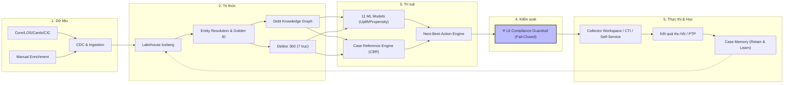

# B.COLLECTION — KIẾN TRÚC TỔNG THỂ & THẨM ĐỊNH DOANH NGHIỆP
### Nền tảng Ra quyết định Thu hồi nợ Thông minh & Có kiểm soát trên nền Big Data – Graph – AI
**Tác giả & Thẩm định:** Enterprise Architecture & Analytics Taskforce  
**Phạm vi ứng dụng:** Ngân hàng TMCP Đầu tư và Phát triển Việt Nam (BIDV) — Khối Bán lẻ & Khối KHDN  
**Tiêu chuẩn tham chiếu:** BIAN (Banking Industry Architecture Network), TOGAF, Luật BVDLCN 91/2025/QH15, Luật TCTD 32/2024/QH15  
**Phiên bản:** v1.0 (Bản chuẩn hoá hoàn chỉnh)

---

## 📑 MỤC LỤC
1. [Tóm tắt cho Ban Lãnh đạo (Executive Summary)](#1-tóm-tắt-cho-ban-lãnh-đạo-executive-summary)
2. [Mục tiêu Nghiệp vụ & Nguyên tắc Kiến trúc Cốt lõi](#2-mục-tiêu-nghiệp-vụ--nguyên-tắc-kiến-trúc-cốt-lõi)
3. [Khung Pháp lý & Ranh giới Đạo đức (Compliance & Ethics by Design)](#3-khung-pháp-lý--ranh-giới-đạo-đức-compliance--ethics-by-design)
4. [Kiến trúc Logic 8 Tầng (Logical Architecture L0 – L8)](#4-kiến-trúc-logic-8-tầng-logical-architecture-l0--l8)
5. [Tầng Dữ liệu & Hợp nhất Danh tính (Data Lakehouse & Golden ID)](#5-tầng-dữ-liệu--hợp-nhất-danh-tính-data-lakehouse--golden-id)
6. [Tầng Tri thức: Chân dung Nợ 7 Trục & Debt Knowledge Graph](#6-tầng-tri-thức-chân-dung-nợ-7-trục--debt-knowledge-graph)
7. [Tầng Quyết định & AI/ML Portfolio (NBA, Uplift, CBR & LLM Gateway)](#7-tầng-quyết-định--aiml-portfolio-nba-uplift-cbr--llm-gateway)
8. [Tầng Kiểm soát & Thực thi (L6 Guardrail, Temporal BPM & Omnichannel)](#8-tầng-kiểm-soát--thực-thi-l6-guardrail-temporal-bpm--omnichannel)
9. [Giải pháp cho 5 Điểm nghẽn Kỹ thuật Thực chiến](#9-giải-pháp-cho-5-điểm-nghẽn-kỹ-thuật-thực-chiến)
10. [Lộ trình Triển khai (Phased Roadmap) & Mô hình Vận hành (TOM)](#10-lộ-trình-triển-khai-phased-roadmap--mô-hình-vận-hành-tom)
11. [Kế hoạch Hành động Ngay (Immediate Action Items)](#11-kế-hoạch-hành-động-ngay-immediate-action-items)

---

## 1. TÓM TẮT CHO BAN LÃNH ĐẠO (EXECUTIVE SUMMARY)

B.Collection không đơn thuần là phần mềm quản lý hồ sơ hay hệ thống gọi điện tự động (Auto-dialer). Bản chất bài toán là **tối ưu hoá phân bổ nguồn lực thu hồi trên một tập danh mục nợ có xác suất thu hồi rất khác nhau**.

Hệ thống hoạt động theo nguyên lý **vòng lặp khép kín có kiểm soát (Governed Closed-loop Decisioning)**:
```
Dữ liệu nguồn → Entity Resolution → Customer 360 & Graph → Dự báo ML/CBR → 
Chiến lược (NBA) → [⛨ L6 Guardrail Chặn cứng] → Thực thi Đa kênh → Kết quả & Đóng case → Case Memory (Học lại)
```



### 3 Giá trị Kinh tế Cốt lõi:
1. **Tối ưu hóa Chi phí Thu hồi (Cost-to-Collect):** Mô hình Uplift (ML9) + Lọc Self-cure (ML1) giúp loại trừ 15–20% trường hợp tự trả nợ, không lãng phí chi phí nhân sự và tổng đài.
2. **Tăng Tỷ lệ Thu hồi Nợ xấu (Recovery Rate):** Debt Knowledge Graph và Case Reference Engine giúp truy vết dòng tiền, nhóm nợ liên đới và gợi ý phương án đàm phán chính xác.
3. **Triệt tiêu Rủi ro Pháp lý & Danh tiếng:** Tầng L6 Compliance Guardrail chạy độc lập, *deterministic* và *fail-closed*, ngăn chặn 100% cuộc gọi/nhắn tin quấy rối hoặc vi phạm quyền riêng tư dữ liệu.

---

## 2. MỤC TIÊU NGHIỆP VỤ & NGUYÊN TẮC KIẾN TRÚC CỐT LÕI

### 2.1 Ma trận Mục tiêu & Chỉ số Đo lường (18 Tháng)
| Mã | Mục tiêu Nghiệp vụ | Chỉ số Đo lường (KPI) | Kỳ vọng Đạt được |
|:---|:---|:---|:---:|
| **M1** | Tăng tỷ lệ tự khỏi nợ nhóm sớm | Cure rate B1 (DPD 1–30) | **+8 – 12%** |
| **M2** | Giảm dịch chuyển nhóm nợ xấu hơn | Roll rate B1→B2, B2→B3 | **−15 – 20%** |
| **M3** | Nâng cao hiệu quả thu hồi nợ đã xử lý rủi ro | Recovery rate NPL / XLRR | **+10 – 15%** |
| **M4** | Cắt giảm chi phí vận hành thu hồi | Cost-to-Collect (CTC / đồng thu được) | **−20 – 25%** |
| **M5** | Nâng cao chất lượng tiếp cận đúng người | Right Party Contact (RPC) Rate | **+25%** |
| **M6** | Tăng độ chuẩn xác cam kết trả nợ | PTP Kept Rate (giữ đúng hẹn trả nợ) | **+15%** |
| **M7** | Rút ngắn thời gian xử lý một case | Time-to-Resolution theo bucket | **−30%** |
| **M8** | Bảo vệ uy tín thương hiệu ngân hàng | Tỷ lệ khiếu nại / 1.000 tương tác | **Giảm 50% & Trace 100%** |

### 2.2 7 Nguyên tắc Kiến trúc Bắt buộc (Architecture Principles)
* **AP1 – Compliance by Design & Fail-Closed:** Mọi lệnh tương tác ra ngoài bắt buộc phải qua Guardrail Service. Guardrail lỗi hoặc timeout = **Hard Block** (chặn hành động).
* **AP2 – Data Minimization & Purpose Limitation:** Dữ liệu thu thập phải có mục đích đăng ký rõ ràng, gán nhãn TTL (Time-To-Live) và định danh Data Owner.
* **AP3 – Provenance-First:** Mọi thông tin trong Chân dung nợ phải lưu vết: *Nguồn nào, ai nhập, thời điểm nào, độ tin cậy bao nhiêu, căn cứ pháp lý nào*.
* **AP4 – Human-in-the-Loop cho Hành động Trọng yếu:** AI chỉ đóng vai trò khuyến nghị. Các quyết định không thể đảo ngược (khởi kiện, thu giữ TSBĐ, miễn giảm lãi, bán nợ) phải có cán bộ có thẩm quyền phê duyệt.
* **AP5 – Tách biệt Decisioning (Bộ não) khỏi Execution (Tay chân):** Thay đổi logic chiến lược không làm gián đoạn hạ tầng tổng đài/SMS/kênh số.
* **AP6 – Explainability (Khả năng giải thích):** Mọi điểm số ML và khuyến nghị NBA phải xuất kèm *Reason Codes* và dẫn chứng để phục vụ thanh tra/kiểm toán.
* **AP7 – Tái sử dụng Tài sản Hiện hữu:** Tận dụng tối đa Graph Nhóm khách hàng liên quan (KHLQ), LLM Gateway và hạ tầng Orchestration đã xây dựng tại ngân hàng.

---

## 3. KHUNG PHÁP LÝ & RANH GIỚI ĐẠO ĐỨC (COMPLIANCE BY DESIGN)

### 3.1 Ràng buộc Pháp lý Hiện hành
* **Luật Đầu tư 2020:** Cấm hoàn toàn dịch vụ đòi nợ thuê. Toàn bộ hoạt động thu hồi nợ phải do chính Ngân hàng hoặc các hình thức hợp pháp (Công ty Quản lý Nợ & Khai thác Tài sản - AMC, Văn phòng Luật sư được ủy quyền) thực hiện.
* **Luật Bảo vệ Dữ liệu Cá nhân 91/2025/QH15 & Nghị định 356/2025/NĐ-CP:** Bắt buộc có cơ sở pháp lý xử lý dữ liệu, đánh giá tác động DPIA, bảo đảm quyền được rút lại đồng ý/yêu cầu xóa dữ liệu khi hết nghĩa vụ.
* **Thông tư 18/2019/TT-NHNN & Thông tư 43/2016/TT-NHNN:** Nghiêm cấm đe dọa, xúc phạm; **tuyệt đối không nhắc nợ với người không có nghĩa vụ trả nợ**; giới hạn khung giờ liên lạc (07:00 – 21:00) và tần suất tối đa trong ngày.

### 3.2 Quy định Chuẩn hoá: `negotiation_lever` (Đòn bẩy Đàm phán Hợp pháp)
Hệ thống chuyển đổi khái niệm "điểm tạo áp lực" thành danh mục đóng **`negotiation_lever`** có kiểm soát:

```
┌────────────────────────────────────────────────────────────────────────────────────────┐
│                        QUY ĐỊNH ĐÒN BẨY ĐÀM PHÁN (NEGOTIATION LEVER)                   │
├─────────────────────────────────────────────┬──────────────────────────────────────────┤
│ ✅ ĐƯỢC PHÉP (Closed Enum trong hệ thống)   │ 🚫 BỊ CẤM & CHẶN CỨNG BỞI GUARDRAIL      │
├─────────────────────────────────────────────┼──────────────────────────────────────────┤
│ 1. Ảnh hưởng điểm tín dụng CIC & vay vốn    │ 1. Gây áp lực qua người thân/đồng nghiệp │
│ 2. Xử lý tài sản bảo đảm theo hợp đồng      │ 2. Khai thác đời tư: sức khỏe, tôn giáo  │
│ 3. Chi phí lãi phạt phát sinh định lượng    │ 3. Thông tin về trường học, con cái      │
│ 4. Chi phí & rủi ro khi chuyển tố tụng      │ 4. Đe dọa, bôi nhọ, bêu tên trên MXH     │
│ 5. Cơ hội: Miễn giảm lãi, giãn hoãn nợ      │ 5. Mua bán dữ liệu từ nguồn trôi nổi     │
│ 6. Điểm rơi dòng tiền (lương, mùa vụ)       │ 6. Sử dụng tài khoản mạng xã hội giả mạo │
└─────────────────────────────────────────────┴──────────────────────────────────────────┘
```

### 3.3 Cờ Khách hàng Dễ tổn thương (Vulnerability Flag)
Khi khách hàng rơi vào diện: điều trị bệnh hiểm nghèo, mất sức lao động, ảnh hưởng thiên tai dịch bệnh, người cao tuổi neo đơn → Hệ thống **tự động chuyển sang luồng hỗ trợ/tái cơ cấu, khóa toàn bộ các biện pháp nhắc nợ cứng**.

---

## 4. KIẾN TRÚC LOGIC 8 TẦNG (LOGICAL ARCHITECTURE L0 – L8)

```
┌────────────────────────────────────────────────────────────────────────────────────────┐
│ L8. TRẢI NGHIỆM & GIAO DIỆN (UI/UX)                                                    │
│     Collector Workspace │ Field Mobile App │ Self-Service Debt Portal │ Strategy Admin │
├────────────────────────────────────────────────────────────────────────────────────────┤
│ L7. THỰC THI & ĐIỀU PHỐI KÊNH (Execution)                                              │
│     Case Workflow (Temporal BPM) │ Voice CTI / Dialer │ Zalo ZNS / SMS │ Legal Module  │
├────────────────────────────────────────────────────────────────────────────────────────┤
│ ⛨ L6. TẦNG KIỂM SOÁT TUÂN THỦ (Compliance Guardrail - Deterministic, Fail-Closed)      │
│     Legal Basis Gate │ Party Eligibility (No 3rd Party) │ Frequency Cap │ Time Window  │
│     Content Filter (Anti-Harassment) │ Vulnerability Gate │ Immutable Audit Ledger     │
├────────────────────────────────────────────────────────────────────────────────────────┤
│ L5. QUYẾT ĐỊNH & CHIẾN LƯỢC (Decisioning)                                              │
│     Dynamic Segmentation │ Next-Best-Action (NBA) │ Constrained Optimizer              │
│     Champion–Challenger Engine │ Treatment Ladder Rule Engine                          │
├────────────────────────────────────────────────────────────────────────────────────────┤
│ L4. TRÍ TUỆ NHÂN TẠO & MÔ HÌNH (AI / ML / GenAI)                                       │
│     11 ML Models (Uplift/Propensity) │ Case Reference Engine (CBR) │ LLM Gateway RAG   │
│     Post-call ASR Speech Analytics │ Feature Store (Feast) │ MLOps Model Governance    │
├────────────────────────────────────────────────────────────────────────────────────────┤
│ L3. TRI THỨC DOANH NGHIỆP (Knowledge Layer)                                            │
│     Debtor 360 (7 Trục) │ Debt Knowledge Graph (Neo4j) │ Entity Resolution (Golden ID) │
│     Manual Enrichment Store (Structured Schema & Provenance)                           │
├────────────────────────────────────────────────────────────────────────────────────────┤
│ L2. NỀN TẢNG DỮ LIỆU (Lakehouse & Storage)                                             │
│     Medallion (Bronze → Silver → Gold) │ Apache Iceberg │ Vector Store (Milvus)        │
│     Data Lineage │ Data Quality Governance │ Tokenization & Masking Engine             │
├────────────────────────────────────────────────────────────────────────────────────────┤
│ L1. THU THẬP & TÍCH HỢP (Ingestion & Integration Layer)                                │
│     Real-time CDC (Debezium/Kafka) │ Micro-Batch Spark │ Governed OSINT Adapter        │
├────────────────────────────────────────────────────────────────────────────────────────┤
│ L0. NGUỒN DỮ LIỆU (Data Sources)                                                       │
│     Core Banking │ LOS/CLMS │ Thẻ │ CIF │ TSBĐ │ CIC │ CRM │ Tổng đài │ Cổng QG ĐKKD    │
```

> 🌐 **Bản đồ tương tác trực quan:** [Mở B.Collection 9-Layer Architecture HTML](file:///Users/giangbh/BLending/BCollection/docs/diagram/B.Collection-9-Layer-Architecture.html)  
> 📊 **Đặc tả Archify IR:** [`docs/diagram/bcollection-9-layer-architecture.json`](file:///Users/giangbh/BLending/BCollection/docs/diagram/bcollection-9-layer-architecture.json)

---

## 5. TẦNG DỮ LIỆU & HỢP NHẤT DANH TÍNH (DATA LAKEHOUSE & GOLDEN ID)

### 5.1 Kiến trúc Lakehouse Medallion
* **Bronze Layer (Raw):** Dữ liệu bất biến lưu trữ nguyên trạng từ Core Banking, LOS, hệ thống Thẻ, kèm metadata: `ingest_ts`, `source_system`, `batch_id`.
* **Silver Layer (Curated):** Dữ liệu đã qua làm sạch, chuẩn hóa số điện thoại (E.164), chuẩn hóa địa chỉ hành chính Việt Nam, mã hóa/tokenization dữ liệu định danh PII.
* **Gold Layer (Aggregated/Mart):** Bảng dữ liệu chiều phục vụ phân tích: `dm_debtor_360`, `dm_case_timeline`, `dm_treatment_outcome`, `dm_collateral_linkage`.

### 5.2 Deterministic + Probabilistic Entity Resolution (Golden ID)
Để tránh gộp nhầm khách hàng trùng tên hoặc chia tách sai một khách hàng sở hữu nhiều mã CIF, hệ thống triển khai pipeline 3 giai đoạn:
1. **Blocking:** Gom nhóm ứng viên dựa trên CCCD/Định danh VNeID, Mã số thuế, Số điện thoại chuẩn hóa.
2. **Scoring:** Thuật toán so khớp tiếng Việt có dấu, so khớp âm vị (Double Metaphone cho tên Việt) và ngày tháng năm sinh.
3. **Clustering & Human-in-the-loop Queue:**
   * *Điểm khớp ≥ 0.90:* Tự động gán Golden ID.
   * *Điểm khớp 0.70 – 0.89:* Đẩy vào hàng đợi phê duyệt của chuyên viên kiểm soát dữ liệu.
   * *Điểm khớp < 0.70:* Tách thành hai thực thể độc lập.

---

## 6. TẦNG TRI THỨC: CHÂN DUNG NỢ 7 TRỤC & DEBT KNOWLEDGE GRAPH

### 6.1 Mô hình Chân dung Nợ 7 Trục (Debtor Persona Model)

```
                       ┌─────────────────────────────────────────┐
                       │        CHÂN DUNG NỢ 7 TRỤC (7 AXES)     │
                       └─────────────────────────────────────────┘
                                            │
        ┌───────────────┬───────────────────┼───────────────────┬───────────────┐
        ▼               ▼                   ▼                   ▼               ▼
┌───────────────┐┌───────────────┐  ┌───────────────┐   ┌───────────────┐┌───────────────┐
│ D1. Ability   ││ D2.Willingness│  │D3.Contactable │   │D4. Root Cause ││ D5. Network   │
│ - Dòng tiền   ││ - Lịch sử PTP │  │ - Kênh tối ưu │   │ - Mất việc    ││ - Nhóm KHLQ   │
│ - DTI thực tế ││ - Phản ứng    │  │ - Giờ tối ưu  │   │ - Mùa vụ      ││ - Bảo lãnh    │
└───────────────┘└───────────────┘  └───────────────┘   └───────────────┘└───────────────┘
                                            │
                            ┌───────────────┴───────────────┐
                            ▼                               ▼
                    ┌───────────────┐               ┌───────────────┐
                    │  D6. Levers   │               │ D7. Risk/Vuln │
                    │ - Đòn bẩy     │               │ - Bệnh tật    │
                    │   hợp pháp    │               │ - Tranh chấp  │
                    └───────────────┘               └───────────────┘
```

### 6.2 Debt Knowledge Graph Schema
* **Node Types:** `Person`, `Organization`, `LoanContract`, `Collateral`, `PhoneNumber`, `Address`, `BankAccount`, `CollectionCase`, `LegalCase`.
* **Edge Types:** `OWNS_ASSET`, `GUARANTEES_FOR`, `CO_BORROWER`, `CONTROLS_COMPANY`, `SHARES_CONTACT`, `TRANSFERRED_ASSET_TO` *(cảnh báo tẩu tán)*.
* **Thuật toán Đồ thị Trọng yếu:**
  * **Louvain / Connected Components:** Gom cụm toàn bộ khoản nợ liên đới trong cùng một hệ sinh thái/tập đoàn KHDN.
  * **PageRank & Betweenness Centrality:** Nhận diện đối tượng thực sự nắm giữ dòng tiền và quyền chi phối trong nhóm liên quan.
  * **Shortest Path:** Tìm đường tiếp cận hợp pháp ngắn nhất tới người có nghĩa vụ (không đi qua bên thứ ba vô can).

---

## 7. TẦNG QUYẾT ĐỊNH & AI/ML PORTFOLIO

### 7.1 Danh mục 11 Mô hình ML Chuyên biệt
1. **ML1 (Self-cure Propensity):** Dự báo xác suất khách hàng tự thanh toán trong 7 ngày không cần tác động.
2. **ML2 (Roll-rate / Short-term PD):** Dự báo xác suất nhảy nhóm nợ xấu hơn trong vòng 30 ngày.
3. **ML3 (Recovery Amount Forecast):** Dự báo số tiền kỳ vọng thu hồi ròng ($EAD \times LGD_{\text{dynamic}}$).
4. **ML4 (Contactability & Best-Time-to-Call):** Tối ưu hóa kênh và khung giờ tiếp cận cho từng số liên lạc.
5. **ML5 (PTP Keeping Propensity):** Dự báo độ tin cậy của lời hứa thanh toán (Promise-to-Pay).
6. **ML6 (Settlement / Haircut Optimization):** Tính toán tỷ lệ miễn giảm lãi tối ưu để đạt thỏa thuận tất toán.
7. **ML7 (Litigation Worthiness):** So sánh $NPV(\text{Khởi kiện})$ với $NPV(\text{Thương lượng})$ và $NPV(\text{Bán nợ})$.
8. **ML8 (Asset Dissipation Alert):** Phát hiện bất thường trong giao dịch và chuyển nhượng tài sản bảo đảm.
9. **ML9 (Treatment Uplift Model):** Đo lường mức độ tác động gia tăng ($\Delta$ Uplift) của từng hành động cụ thể trên từng khách hàng.
10. **ML10 (Persona Vector Embedding):** Nén dữ liệu 7 trục thành vector 256 chiều phục vụ so khớp case tương đồng.
11. **ML11 (First-Payment-Default Fraud):** Phát hiện sớm dấu hiệu gian lận hồ sơ vay ngay từ kỳ trả nợ đầu tiên.

### 7.2 Case Reference Engine (CBR 4R)
```
1. RETRIEVE: Tìm Top 5-10 case có Persona Vector và bối cảnh tương đồng nhất (Milvus HNSW Vector Search).
2. REUSE:    Tổng hợp lộ trình xử lý (Playbook) có tỷ lệ thành công cao nhất từ các case tương đồng.
3. REVISE:   Chuyên viên thu hồi đánh giá, tùy chỉnh phương án và ghi nhận phản hồi (Feedback Loop).
4. RETAIN:   Khi case đóng thành công VÀ ĐÃ QUA DUYỆT TUÂN THỦ (compliance_review = passed), lưu vào kho Reference.
```

### 7.3 LLM Gateway & GenAI Use Cases
* **Post-Call Speech-to-Text & Auto-Summarization:** Trích xuất cam kết PTP, ngày thanh toán, lý do chậm trả và cập nhật thẳng vào Persona Card.
* **100% Automated Call QA:** Quét toàn bộ nội dung cuộc gọi để phát hiện từ ngữ phản cảm, đe dọa hoặc sai quy trình nghiệp vụ.
* **Collector Copilot (Constrained Generation):** Gợi ý kịch bản đàm phán dựa trên mẫu đã được Pháp chế phê duyệt sẵn, không sinh text tự do.
* 📄 **Đặc tả Mở rộng Multi-Agent System (MAS):** Xem tài liệu thiết kế chi tiết 7 AI Agents và lộ trình 5 bước xây dựng tại [`B-Collection-Kien-Truc-Multi-Agent-System-Va-Lo-Trinh-Xay-Dung.md`](file:///Users/giangbh/BLending/BCollection/docs/B-Collection-Kien-Truc-Multi-Agent-System-Va-Lo-Trinh-Xay-Dung.md).

---

## 8. TẦNG KIỂM SOÁT & THỰC THI (GUARDRAIL, BPM & OMNICHANNEL)

### 8.1 Quy tắc Hoạt động của L6 Compliance Guardrail
Mọi hành động ra kênh (*Voice Call, SMS, Zalo, Field Visit, Gửi thông báo pháp lý*) đều phải gửi Request Payload qua L6:

```json
{
  "request_id": "REQ-20260901-8842",
  "case_id": "CASE-BIDV-99182",
  "target_party_id": "CIF-882194",
  "channel": "VOICE_OUTBOUND",
  "proposed_time": "2026-09-01T17:30:00+07:00",
  "content_payload": { "template_id": "CALL_SCRIPT_T2", "levers": ["CIC_RECORD"] }
}
```

**Bộ lọc 8 cổng của Guardrail:**
1. *Legal Basis Check:* Hợp đồng vay còn hiệu lực pháp lý.
2. *Party Obligation Gate:* Đối tượng có nghĩa vụ trả nợ/bảo lãnh (Chặn 100% nếu là người thân không bảo lãnh).
3. *Consent & DNC:* Không nằm trong danh sách Do-Not-Contact hoặc đang khiếu nại.
4. *Contact Frequency Cap:* Không quá 3–5 lần/ngày trên tất cả các kênh cộng gộp.
5. *Time Window:* Nằm trong khoảng 07:00 – 21:00 ngày làm việc.
6. *Content Moderation:* Không chứa từ ngữ vi phạm quy chuẩn ứng xử.
7. *Vulnerability Check:* Khách hàng không có cờ dễ tổn thương.
8. *Audit Record:* Ghi log mã hóa bất biến (WORM / Hash-chain) trước khi trả lời `ALLOW`.

---

## 9. GIẢI PHÁP CHO 5 ĐIỂM NGHẼN KỸ THUẬT THỰC CHIẾN

```
┌───────────────────────────────┬────────────────────────────────────────────────────────┐
│ Điểm nghẽn Thực chiến         │ Giải pháp Kiến trúc Doanh nghiệp                       │
├───────────────────────────────┼────────────────────────────────────────────────────────┤
│ 1. Độ trễ Graph Screen-pop    │ Dual-Plane Graph: Tính toán đồ thị phức tạp offline    │
│    khi quy mô > 500M cạnh     │ ban đêm đẩy vào Redis Feature Store; chỉ query online  │
│                               │ 1-hop sub-graph (< 300ms SLA).                         │
├───────────────────────────────┼────────────────────────────────────────────────────────┤
│ 2. Xung đột tải CDC lúc EOD   │ Đọc CDC từ Read-Replica của Core Banking; nhận event   │
│    (23:00 - 02:00 hàng ngày)  │ EOD_COMPLETED để kích hoạt Micro-batch Ingestion.      │
├───────────────────────────────┼────────────────────────────────────────────────────────┤
│ 3. Chi phí hạ tầng ASR Speech │ 95% xử lý Post-Call Batch (bất đồng bộ 5–15 phút);     │
│    Analytics trên 100.000 call│ chỉ stream real-time cho 5% case nợ lớn/nhạy cảm.      │
├───────────────────────────────┼────────────────────────────────────────────────────────┤
│ 4. Khác biệt lớn giữa Bán lẻ  │ Tách riêng 2 Workflow Engine trên Temporal:            │
│    (Retail) & Doanh nghiệp    │ - Retail: Tự động hóa STP, theo dõi DPD bucket.        │
│                               │ - Wholesale/SME: Case Investigation theo Milestone.    │
├───────────────────────────────┼────────────────────────────────────────────────────────┤
│ 5. Hiện tượng Thu nợ ngầm     │ Tích hợp SIP Softphone & Zalo OA trên Mobile Field App;│
│    (Shadow Collection)        │ Bắt buộc OTP xác thực qua B.Collection mới được Core   │
│                               │ hạch toán miễn giảm lãi/cơ cấu nợ.                     │
└───────────────────────────────┴────────────────────────────────────────────────────────┘
```

---

## 10. LỘ TRÌNH TRIỂN KHAI & MÔ HÌNH VẬN HÀNH

```
[ Giai đoạn 1: Tháng 1 - 6 ] (Foundation, Cleansing & Quick Wins)
├── Làm sạch dữ liệu liên lạc (Phone/Address Cleansing) & Contactability Scoring.
├── Triển khai Collector Workspace v1 + Tích hợp CTI/Dialer.
├── Đưa L6 Compliance Guardrail v1 vào vận hành (Fail-closed).
├── Triển khai 3 mô hình đầu: ML1 (Self-cure), ML2 (Roll-rate), ML4 (Best-time-to-call).
└── BẮT BUỘC THIẾT LẬP HOLDOUT GROUP (5-10%) ĐỂ ĐO LƯỜNG UPLIFT.

[ Giai đoạn 2: Tháng 7 - 14 ] (Knowledge Graph, Advanced ML & CBR)
├── Triển khai Debt Knowledge Graph trên nền hệ thống KHLQ sẵn có.
├── Hoàn thiện Suite mô hình: ML3, ML5, ML6, ML9 (Uplift), ML10 (Persona Embedding).
├── Vận hành Case Reference Engine v1 (CBR) và Next-Best-Action Engine.
├── Triển khai Speech-to-Text tóm tắt cuộc gọi và 100% Automated QA.
└── Đưa Self-Service Debt Portal vào hoạt động cho khách hàng.

[ Giai đoạn 3: Tháng 15 - 24 ] (Omnichannel AI & Portfolio Optimization)
├── Tối ưu hóa ràng buộc toàn danh mục (Constrained Optimization).
├── Mở rộng toàn diện cho KHDN lớn, chuỗi sở hữu phức tạp và nợ nhóm liên đới.
├── Collector Copilot tương tác thời gian thực.
└── Tự động hóa Champion-Challenger toàn diện.
```

### Mô hình Vận hành Đề xuất (Target Operating Model - TOM)
* **Product Owner:** Lãnh đạo Khối Xử lý Nợ (sở hữu mục tiêu kinh doanh & KPI thu hồi).
* **Collection Analytics CoE (Trung tâm Phân tích Thu hồi Nợ):** Đội ngũ chuyên trách gồm Data Scientists, Decision Strategists và MLOps Engineers vận hành chiến lược phân khúc và Champion-Challenger.
* **Compliance & Data Privacy Officer (DPO):** Kiểm soát độc lập chính sách L6 Guardrail và kiểm duyệt kho Case Reference.

---

## 11. KẾ HOẠCH HÀNH ĐỘNG NGAY (IMMEDIATE ACTION ITEMS)

| STT | Nhiệm vụ | Đơn vị Chủ trì | Thời hạn | Đầu ra mong đợi |
|:---:|:---|:---|:---:|:---|
| **1** | Trình Hội đồng Kiến trúc (EA Board) phê duyệt Kiến trúc Tổng thể | Lead EA + PO | 2 tuần | Biên bản phê duyệt định hướng kiến trúc v1.0 |
| **2** | Xin ý kiến Pháp chế & DPO bằng văn bản về Quy chế Dữ liệu & DPIA | Ban Pháp chế + DPO | 4 tuần | Văn bản chấp thuận phạm vi thu thập dữ liệu |
| **3** | Thực hiện Data Profiling trên 1 triệu hồ sơ quá hạn lịch sử | Data Team | 3 tuần | Báo cáo tỷ lệ dữ liệu rác và Contactability baseline |
| **4** | Thiết lập môi trường PoC Case Reference Engine & Uplift Model | Data Science Team | 6 tuần | Báo cáo kết quả PoC trên dữ liệu 2 năm gần nhất |

---
*Tài liệu được phát hành chính thức dưới sự bảo trợ của Ban Kiến trúc Doanh nghiệp & Chuyển đổi Số.*
