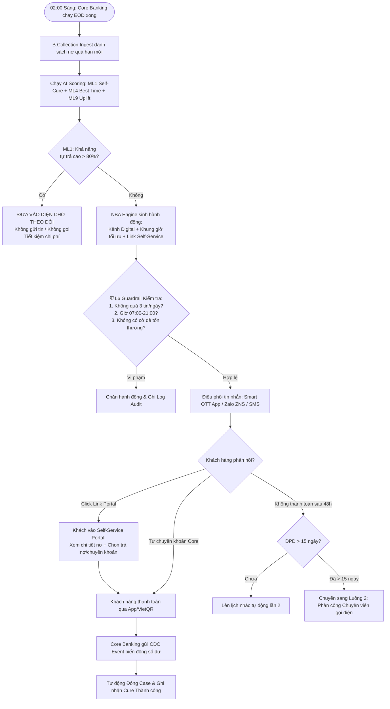
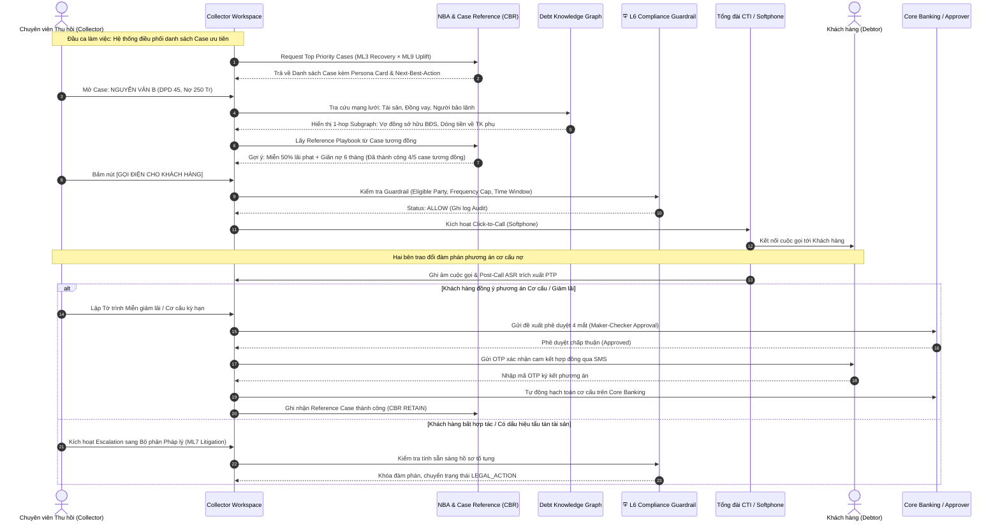
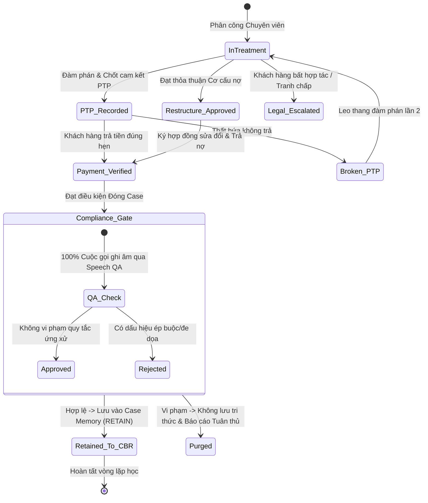

# B.COLLECTION — ĐẶC TẢ LUỒNG NGHIỆP VỤ CỐT LÕI (BUSINESS PROCESS SPECIFICATION)
### Tài liệu Phân tích Nghiệp vụ (BA) cho 2 Luồng Chính của Hệ thống
**Vai trò:** Lead Business Analyst (BA Expert) | **Chuẩn tài liệu:** BABOK v3 / Banking Standards  
**Dự án:** Hệ thống Quản lý & Tối ưu Thu hồi nợ B.Collection — Ngân hàng  
**Phiên bản:** v1.0

---

## 📑 MỤC LỤC
1. [Tổng quan 2 Luồng Nghiệp vụ Trọng yếu](#1-tổng-quan-2-luồng-nghiệp-vụ-trọng-yếu)
2. [LUỒNG 1: Thu hồi Nợ Sớm Tự động & Kênh số (Early Collection & Digital-First Workflow — DPD 1–30)](#2-luồng-1-thu-hồi-nợ-sớm-tự-động--kênh-số-early-collection--digital-first-workflow--dpd-130)
   * [2.1 Sơ đồ Quy trình (Business Process Flow)](#21-sơ-đồ-quy-trình-business-process-flow)
   * [2.2 Bảng Đặc tả Chi tiết từng Bước (Step-by-Step Specification)](#22-bảng-đặc-tả-chi-tiết-từng-bước-step-by-step-specification)
   * [2.3 Quy tắc Nghiệp vụ (Business Rules - BR)](#23-quy-tắc-nghiệp-vụ-business-rules---br)
   * [2.4 Ngoại lệ & Kịch bản Xử lý Lỗi (Exception Flows)](#24-ngoại-lệ--kịch-bản-xử-lý-lỗi-exception-flows)
   * [2.5 Thiết kế Trải nghiệm (UI/UX Mockup & Schema Khách hàng Tự phục vụ)](#25-thiết-kế-trải-nghiệm-uiux-mockup--schema-khách-hàng-tự-phục-vụ)
3. [LUỒNG 2: Thu hồi Nợ Chuyên sâu có Chuyên viên & Đàm phán Cơ cấu (Specialized Collection & Restructuring Workflow — DPD 31–90+)](#3-luồng-2-thu-hồi-nợ-chuyên-sâu-có-chuyên-viên--đàm-phán-cơ-cấu-specialized-collection--restructuring-workflow--dpd-3190)
   * [3.1 Sơ đồ Quy trình & Tương tác CTI (Activity & Sequence Diagram)](#31-sơ-đồ-quy-trình--tương-tác-cti-activity--sequence-diagram)
   * [3.2 Bảng Đặc tả Chi tiết từng Bước (Step-by-Step Specification)](#32-bảng-đặc-tả-chi-tiết-từng-bước-step-by-step-specification)
   * [3.3 Đặc tả Tính năng Case Reference Engine (CBR) & Collector Workspace](#33-đặc-tả-tính-năng-case-reference-engine-cbr--collector-workspace)
   * [3.4 Ma trận Phê duyệt Đàm phán Giảm lãi / Cơ cấu nợ (Maker-Checker Matrix)](#34-ma-trận-phê-duyệt-đàm-phán-giảm-lãi--cơ-cấu-nợ-maker-checker-matrix)
   * [3.5 Vòng lặp Đóng Case & Ghi nhận Tri thức (Closed-loop Case Memory)](#35-vòng-lặp-đóng-case--ghi-nhận-tri-thức-closed-loop-case-memory)

---

## 1. TỔNG QUAN 2 LUỒNG NGHIỆP VỤ TRỌNG YẾU

Hệ thống B.Collection phân định rõ 2 luồng nghiệp vụ xương sống, chiếm 90% khối lượng xử lý và 85% giá trị kinh tế thu hồi của ngân hàng:

```
┌────────────────────────────────────────────────────────────────────────────────────────┐
│                                  DANH MỤC NỢ QUÁ HẠN                                   │
└───────────────────────────────────────────┬────────────────────────────────────────────┘
                                            │
                    ┌───────────────────────┴───────────────────────┐
                    ▼                                               ▼
┌───────────────────────────────────────┐       ┌───────────────────────────────────────┐
│ LUỒNG 1: EARLY COLLECTION (DPD 1–30)  │       │ LUỒNG 2: LATE COLLECTION (DPD 31–90+) │
│ - Khối lượng lớn (High Volume)        │       │ - Phức tạp cao (High Complexity)      │
│ - Tự động hóa Kênh số (Digital-First) │       │ - Có Chuyên viên (Collector-driven)   │
│ - Tự phục vụ (Self-Service Portal)    │       │ - Tra cứu Graph, Đàm phán & Cơ cấu    │
│ - Lọc nhóm tự trả (Self-Cure ML1)     │       │ - Gợi ý Playbook từ Case Memory (CBR) │
└───────────────────────────────────────┘       └───────────────────────────────────────┘
```

---

## 2. LUỒNG 1: THU HỒI NỢ SỚM TỰ ĐỘNG & KÊNH SỐ (DPD 1–30)

* **Đối tượng:** Khách hàng cá nhân / Thẻ tín dụng / Vay tiêu dùng / Vay mua nhà xe có DPD từ 1 đến 30 ngày.
* **Mục tiêu:** Tăng tỷ lệ tự khỏi nợ (Cure Rate) lên +10%, giảm chi phí liên hệ (Cost-to-Collect) xuống −25%, giảm tỷ lệ nợ nhảy sang nhóm 2 (B2).

### 2.1 Sơ đồ Quy trình (Business Process Flow)



---

### 2.2 Bảng Đặc tả Chi tiết từng Bước (Step-by-Step Specification)

| Bước | Tác nhân / Hệ thống | Hành động / Xử lý nghiệp vụ | Dữ liệu Đầu vào | Dữ liệu Đầu ra |
|:---:|:---|:---|:---|:---|
| **1.1** | Core Banking / CDC | Phát tín hiệu `EOD_COMPLETED` kèm danh sách tài khoản quá hạn $DPD \ge 1$. | Bảng sao kê nợ EOD | Event `LOAN_DELINQUENT_CREATED` |
| **1.2** | B.Collection Batch Engine | Thu nạp hồ sơ, đồng bộ thông tin số dư tài khoản CASA, lịch sử trả nợ 12 tháng. | Mã hợp đồng, CIF | Debtor Profile ban đầu |
| **1.3** | AI Scoring Suite | Chạy 3 mô hình đồng thời:<br>1. **ML1 (Self-cure):** Xác suất tự trả trong 7 ngày ($P_{\text{cure}}$).<br>2. **ML4 (Contactability):** Kênh ưu tiên (App > Zalo > SMS) và khung giờ tối ưu.<br>3. **ML9 (Uplift):** Dự báo mức độ hiệu quả khi gửi tin nhắn. | Debtor 360, Feature Store | Vector điểm số: `[p_cure, best_channel, best_hour, uplift_score]` |
| **1.4** | Decision Engine (NBA) | *Phân nhánh quyết định:*<br>- Nếu $P_{\text{cure}} \ge 0.80$: Đặt trạng thái `WATCH_HOLDOUT` (tạm hoãn 48h).<br>- Nếu $P_{\text{cure}} < 0.80$: Sinh hành động `DIGITAL_REMINDER` kèm tokenized URL dẫn tới Cổng tự phục vụ. | Điểm số ML | `ProposedActionPayload` |
| **1.5** | **⛨ L6 Compliance Guardrail** | **Kiểm tra bắt buộc trước khi gửi (Fail-closed):**<br>1. Khung giờ hiện tại có từ 07:00 – 21:00?<br>2. Tổng số lượt liên hệ trong 24h qua $< 3$ lần?<br>3. Khách hàng không có `Vulnerability Flag`?<br>4. Nội dung tin nhắn tuân thủ mẫu chuẩn phê duyệt? | `ProposedActionPayload` | Phản hồi `ALLOW` kèm chữ ký số hoặc `DENY` kèm mã lý do |
| **1.6** | Omnichannel Dispatcher | Gửi tin nhắn theo thứ tự ưu tiên chi phí: In-App Push (0đ) $\rightarrow$ Zalo ZNS (rẻ) $\rightarrow$ SMS Brandname. | Mẫu tin nhắn, SĐT chuẩn E.164 | Trạng thái gửi: `DELIVERED` / `READ` |
| **1.7** | Khách hàng | Khách hàng nhận tin, click vào liên kết rút gọn dạng `bank.vn/c/{token}`. | Mã OTP SMS/SmartOTP | Màn hình Portal cá nhân hóa |
| **1.8** | Self-Service Portal | Hiển thị: Tổng nợ gốc, tiền lãi, phí phạt, số ngày quá hạn + Nút *"Thanh toán ngay qua Ngân hàng số / VietQR"* + Tùy chọn *"Hẹn ngày thanh toán (PTP)"*. | Token bảo mật 1 lần | Xác nhận thanh toán hoặc ghi nhận PTP |
| **1.9** | Core Banking & Settlement | Khách hàng quét mã trả nợ. Core hạch toán và bắn CDC event về B.Collection. | Giao dịch hạch toán | Case chuyển trạng thái `RESOLVED_CURED` |

---

### 2.3 Quy tắc Nghiệp vụ (Business Rules - BR)

* **BR-EC-01 (Quy tắc Giảm phiền toái - Do-Not-Bother Rule):** Khách hàng có điểm $P_{\text{cure}} \ge 0.80$ và lịch sử luôn trả nợ trong 3 ngày đầu của kỳ sao kê sẽ **tuyệt đối không bị gửi tin nhắc nợ trong 72 giờ đầu tiên**.
* **BR-EC-02 (Quy tắc Khung giờ Vàng):** Tin nhắn chỉ được kích hoạt phát đi trong khoảng thời gian từ **08:30 – 11:30** và **14:00 – 19:30**. Hệ thống tự động hoãn (queue) các lệnh sinh ra ngoài khung giờ này.
* **BR-EC-03 (Quy tắc Token Bảo mật):** Đường dẫn truy cập Cổng tự phục vụ (`bank.vn/c/{token}`) có thời hạn hiệu lực **48 giờ** và tự động hủy sau khi hoàn thành thanh toán.
* **BR-EC-04 (Quy tắc Cập nhật Dừng tức thì):** Khi khách hàng đã thanh toán đủ số tiền quá hạn tối thiểu, hệ thống phải **hủy ngay lập tức toàn bộ các lịch gửi tin/gọi điện đã lên lịch trong hàng đợi** trong vòng tối đa **60 giây**.

---

### 2.4 Ngoại lệ & Kịch bản Xử lý Lỗi (Exception Flows)

| Mã Lỗi | Kịch bản Ngoại lệ | Hành động Xử lý của Hệ thống |
|:---|:---|:---|
| **EX-01** | Tin nhắn OTT App / Zalo gửi không thành công (khách tắt mạng / chưa cài Zalo). | Tự động Fallback sang gửi **SMS Brandname** sau 15 phút. Nếu SMS thất bại $\rightarrow$ Ghi nhận cờ `INVALID_PHONE` đẩy về Data Quality Queue. |
| **EX-02** | Khách hàng tạo cam kết PTP (hẹn trả nợ) trên Portal nhưng đến ngày hẹn không có tiền về. | Kích hoạt mô hình **ML5 (PTP Broken)** $\rightarrow$ Tự động hủy quyền tự phục vụ $\rightarrow$ Chuyển case sang Luồng 2 (gán Chuyên viên gọi điện trực tiếp). |
| **EX-03** | Khách hàng khai báo cờ "Bệnh tật/Thiên tai" trên Portal. | Hệ thống lập tức khóa toàn bộ lệnh đòi nợ $\rightarrow$ Chuyển hồ sơ sang Hàng đợi `VULNERABILITY_REVIEW` của Khối Pháp chế & Xử lý Nợ. |

---

### 2.5 Thiết kế Trải nghiệm (UI/UX Khách hàng trên Self-Service Portal)

```
┌────────────────────────────────────────────────────────┐
│  Ngân hàng — THÔNG BÁO DƯ NỢ & HỖ TRỢ THANH TOÁN            │
├────────────────────────────────────────────────────────┤
│ Kính gửi: NGUYỄN VĂN A                                 │
│ Hợp đồng vay số: LD240899120                           │
│ Trạng thái: Quá hạn 3 ngày (DPD 3)                     │
├────────────────────────────────────────────────────────┤
│ CHI TIẾT NGHĨA VỤ THANH TOÁN ĐẾN HÔM NAY:              │
│  - Gốc quá hạn:                    5.000.000 VNĐ       │
│  - Lãi trong hạn:                  1.250.000 VNĐ       │
│  - Lãi phạt quá hạn:                  15.000 VNĐ       │
│  ---------------------------------------------         │
│  TỔNG SỐ TIỀN CẦN THANH TOÁN:      6.265.000 VNĐ       │
├────────────────────────────────────────────────────────┤
│ [ NÚT: THANH TOÁN NGAY QUA SMARTBANKING / VIETQR ]     │
│ [ NÚT: TÔI ĐÃ CHUYỂN KHOẢN (GỬI ỦY NHIỆM CHI) ]        │
│ [ NÚT: TÔI GẶP KHÓ KHĂN / ĐỀ NGHỊ GIA HẠN KỲ HẠN ]     │
├────────────────────────────────────────────────────────┤
│ ℹ️ Lưu ý: Thanh toán đúng hạn giúp bảo vệ điểm tín dụng │
│ CIC và đảm bảo quyền lợi hạn mức vay trong tương lai.   │
└────────────────────────────────────────────────────────┘
```

---

## 3. LUỒNG 2: THU HỒI NỢ CHUYÊN SÂU CÓ CHUYÊN VIÊN & ĐÀM PHÁN CƠ CẤU (DPD 31–90+)

* **Đối tượng:** Khách hàng cá nhân nợ xấu kéo dài ($DPD \ge 31$), Khách hàng Doanh nghiệp (SME/Corporate), hoặc các case thất hứa PTP nhiều lần.
* **Mục tiêu:** Nâng cao Recovery Rate (+15%), giảm thất thoát nợ xấu, truy vết tài sản bảo đảm, đàm phán cơ cấu nợ và hoàn thiện hồ sơ pháp lý chuẩn mực.

---

### 3.1 Sơ đồ Quy trình & Tương tác CTI (Activity & Sequence Diagram)



---

### 3.2 Bảng Đặc tả Chi tiết từng Bước (Step-by-Step Specification)

| Bước | Tác nhân | Hành động / Xử lý nghiệp vụ | Giao diện / Chức năng | Kết quả / Trạng thái |
|:---:|:---|:---|:---|:---|
| **2.1** | Hệ thống (Temporal BPM) | Tự động phân bổ hồ sơ vào đầu ca làm việc dựa trên thuật toán **Skill-based Routing** (Chuyên viên giỏi KHDN nhận case nợ doanh nghiệp, chuyên viên giỏi pháp lý nhận case nợ khó). | Engine phân việc | Case gán vào Queue của Collector |
| **2.2** | Chuyên viên (Collector) | Đăng nhập hệ thống, xem **Debtor 360 Screen-Pop** hiển thị đầy đủ 7 trục chân dung trong vòng $< 2$ giây. | Màn hình `Debtor 360 Workspace` | Nắm bắt bối cảnh, lý do chậm trả, đòn bẩy đàm phán |
| **2.3** | Case Reference Engine | Tự động so khớp vector và hiển thị **Khuyến nghị Playbook**: *"Gợi ý gọi khung 18:00 – 19:30, sử dụng đòn bẩy CIC và chào phương án giãn nợ 6 tháng."* | Hộp thoại `AI Copilot Recommendations` | Collector chọn áp dụng hoặc tùy biến |
| **2.4** | Chuyên viên | Nhấn nút **Click-to-Call**. | Tích hợp WebRTC / SIP Softphone | Lệnh gửi tới L6 Guardrail |
| **2.5** | **⛨ L6 Compliance Guardrail** | Kiểm tra: Số gọi đi thuộc sở hữu chính chủ của người có nghĩa vụ (không gọi người thân vô can); số cuộc gọi trong ngày tới số này $\le 2$ lần. | Dịch vụ Guardrail | Cấp quyền quay số (`DIAL_PERMITTED`) |
| **2.6** | Tổng đài CTI & ASR | Thực hiện kết nối cuộc gọi. Ghi âm toàn bộ cuộc gọi và gửi luồng âm thanh về bộ phận **Post-Call Speech Analytics** để trích xuất tự động: Số tiền cam kết, ngày hẹn trả nợ, mức độ thiện chí. | CTI Module + Whisper ASR | Bản tóm tắt cuộc gọi tự động điền vào Form ghi nhận kết quả |
| **2.7** | Chuyên viên & Lãnh đạo | Nếu đàm phán thành công phương án giảm lãi/cơ cấu nợ: Chuyên viên tạo yêu cầu $\rightarrow$ Lãnh đạo phòng duyệt $\rightarrow$ Sinh thỏa thuận điện tử gửi khách hàng xác nhận OTP. | Module `Restructure Workflow` | Phê duyệt hoàn tất, cập nhật Core Banking |
| **2.8** | Case Memory Engine | Khi thỏa thuận được ký và khách hàng thanh toán đúng cam kết: Toàn bộ chuỗi hành động và bối cảnh được mã hóa vector đẩy vào kho **Case Reference (RETAIN)** để huấn luyện cho các case tương lai. | CBR Service | Tăng độ chính xác của AI |

---

### 3.3 Đặc tả Tính năng Case Reference Engine (CBR) trên Collector Workspace

```
┌────────────────────────────────────────────────────────────────────────────────────────┐
│ 👤 HỒ SƠ KHÁCH HÀNG: CÔNG TY TNHH XÂY DỰNG TOÀN CẦU (MST: 01029384xx)                  │
│ Dư nợ: 1.850.000.000 VNĐ | DPD: 62 ngày (Nhóm 2) | Sản phẩm: Thấu chi DN               │
├────────────────────────────────────────────────────────────────────────────────────────┤
│ 🧭 PHÂN TÍCH CHÂN DUNG (PERSONA 360):                                                  │
│  • Dòng tiền (Ability): Đang có hợp đồng trúng thầu dự án A (Dòng tiền về Q4).        │
│  • Thiện chí (Willingness): Trung bình (Đã trễ hẹn 2 lần nhưng vẫn nghe máy).          │
│  • Mạng lưới (Graph): Giám đốc đồng sở hữu BĐS tại Hà Đông (Đang thế chấp tại Ngân hàng).   │
├────────────────────────────────────────────────────────────────────────────────────────┤
│ 💡 GỢI Ý PLAYBOOK TỪ AI (DỰA TRÊN 4 CASE THÀNH CÔNG TƯƠNG ĐỒNG - ĐỘ KHỚP 91%):          │
│  1. Đòn bẩy hiệu quả nhất (Lever): Tác động qua Hạn mức tín dụng của Doanh nghiệp.    │
│  2. Phương án khuyến nghị: Thu trước 30% nợ gốc (555 Tr) + Cơ cấu giãn kỳ hạn 6 tháng. │
│  3. Tỷ lệ thành công kỳ vọng: 84% | Thời gian thu hồi dự kiến: 15 ngày.                │
│                                                                                        │
│  [ ÁP DỤNG PLAYBOOK NÀY ]      [ TÙY CHỈNH PHƯƠNG ÁN ]      [ TỪ CHỐI (GHI LÝ DO) ]    │
└────────────────────────────────────────────────────────────────────────────────────────┘
```

---

### 3.4 Ma trận Phê duyệt Đàm phán Giảm lãi / Cơ cấu nợ (Maker-Checker Matrix)

Để đảm bảo chặt chẽ trong quản trị rủi ro ngân hàng, mọi phương án đàm phán giảm lãi phạt hoặc giãn hoãn nợ phải tuân theo phân quyền phê duyệt tự động:

| Cấp Thẩm quyền | Hạn mức Giảm Lãi phạt | Hạn mức Giãn Kỳ hạn | Thời gian SLA Phê duyệt |
|:---|:---:|:---:|:---:|
| **Cấp 1: Chuyên viên Xử lý Nợ (Maker)** | $\le 10\%$ (Tối đa 5 Tr) | Không được phép | Khởi tạo trong 15 phút |
| **Cấp 2: Trưởng nhóm / Trưởng phòng XLN** | $\le 30\%$ (Tối đa 50 Tr) | Giãn hoãn $\le 3$ tháng | Phê duyệt trong 2 giờ |
| **Cấp 3: Giám đốc Khối Xử lý Nợ** | $\le 70\%$ (Tối đa 200 Tr) | Giãn hoãn $\le 6$ tháng | Phê duyệt trong 4 giờ |
| **Cấp 4: Hội đồng Xử lý Rủi ro Ngân hàng** | $> 70\%$ hoặc nợ $> 200$ Tr | Giãn hoãn $> 6$ tháng | Phê duyệt trong 24 giờ |

---

### 3.5 Vòng lặp Đóng Case & Ghi nhận Tri thức (Closed-Loop Case Memory)



---

## 4. KẾT LUẬN & BÀN GIAO CHO ĐỘI NGŨ PHÁT TRIỂN (HANDOFF TO DEV/QA)

Bản đặc tả 2 luồng nghiệp vụ trên đã chuẩn hóa:
1. **Toàn bộ điều kiện rẽ nhánh và thuật toán tính toán** của các mô hình AI/ML (Self-cure, Best-time, Uplift, CBR).
2. **Bộ quy tắc chặn cứng của Tầng L6 Compliance Guardrail** đảm bảo an toàn pháp lý tuyệt đối.
3. **Các API Contracts và sự kiện Event-Driven** trao đổi giữa B.Collection với Core Banking, Tổng đài CTI, và Cổng tự phục vụ.

*Tài liệu này là căn cứ chính thức để Đội ngũ Kỹ sư Phần mềm (SE), Kỹ sư Dữ liệu (DE) và Kiểm thử (QA) xây dựng Test Cases và hiện thực hóa mã nguồn hệ thống.*
