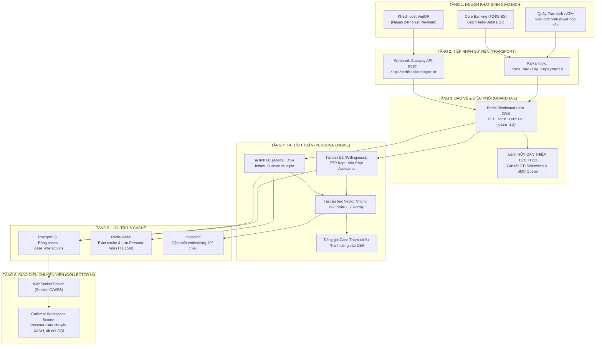

# B.Collection — Đặc Tả Quy Trình Xử Lý Sự Kiện Thanh Toán & Cập Nhật Persona Real-Time

> **Mã tài liệu:** `DOC-BCOLLECTION-PAYMENT-EVENT-01`  
> **Phiên bản:** `1.0.0`  
> **Phạm vi áp dụng:** Phân hệ Thu nhận Dữ liệu (Ingestion), Động cơ Chân dung (Persona Engine), CBR Vector 192D, Guardrail Tuân thủ và Giao diện Bàn làm việc Chuyên viên (Collector Workspace).  
> **Đối tượng độc giả:** Kỹ sư Kiến trúc Phần mềm, Đội ngũ Kỹ thuật Core/Integration, Chuyên viên Phân tích Nghiệp vụ Thu hồi nợ (BA), Ban Quản trị Rủi ro Tín dụng.

---

## MỤC LỤC
1. [Giới thiệu & Bối cảnh Nghiệp vụ](#1-giới-thiệu--bối-cảnh-nghiệp-vụ)
2. [Phân loại Sự kiện Dòng tiền & Thanh toán](#2-phân-loại-sự-kiện-dòng-tiền--thanh-toán)
3. [Kiến trúc Luồng Dữ liệu Sự kiện (Real-Time Event-Driven Architecture)](#3-kiến-trúc-luồng-dữ-liệu-sự-kiện-real-time-event-driven-architecture)
4. [Cơ chế Khóa Phân tán & Chống Đòi Nợ Nhầm (Anti-False-Delinquency)](#4-cơ-chế-khóa-phân-tán--chống-đòi-nợ-nhầm-anti-false-delinquency)
5. [Tác động Chi tiết tới Bộ Chỉ số Persona (D1, D2, D3)](#5-tác-động-chi-tiết-tới-bộ-chỉ-số-persona-d1-d2-d3)
6. [Dịch chuyển Vị trí trong Ma trận Phân khúc Chiến lược 2x2](#6-dịch-chuyển-vị-trí-trong-ma-trận-phân-khúc-chiến-lược-2x2)
7. [Tái cấu trúc Vector Nhúng 192 Chiều & Đóng gói Tri thức CBR](#7-tái-cấu-trúc-vector-nhúng-192-chiều--đóng-gói-tri-thức-cbr)
8. [Cơ chế Đẩy Dữ liệu Thời gian thực lên Giao diện Collector (WebSocket Sync)](#8-cơ-chế-đẩy-dữ-liệu-thời-gian-thực-lên-giao-diện-collector-websocket-sync)
9. [Kịch bản Vận hành Minh họa Mẫu (End-to-End Walkthrough)](#9-kịch-bản-vận-hành-minh-họa-mẫu-end-to-end-walkthrough)
10. [Đặc tả Schema Dữ liệu & Bảng Ánh xạ Kỹ thuật](#10-đặc-tả-schema-dữ-liệu--bảng-ánh-xạ-kỹ-thuật)

---

## 1. Giới thiệu & Bối cảnh Nghiệp vụ

Trong quản lý thu hồi nợ nhóm sớm (Bucket B1: Quá hạn DPD 1–30), độ trễ thông tin giữa **hành động nộp tiền của khách hàng** và **nhận thức của hệ thống nhắc nợ** là nguyên nhân hàng đầu dẫn đến:
1. **Rủi ro đòi nợ nhầm (False Delinquency):** Khách hàng vừa chuyển tiền nhưng 1 phút sau vẫn nhận cuộc gọi đòi nợ hoặc tin nhắn đôn đốc gay gắt $\rightarrow$ Gây bức xúc nghiêm trọng, phát sinh khiếu nại lên Ngân hàng Nhà nước (NHNN) và làm sụt giảm chỉ số tín nhiệm (NPS).
2. **Lãng phí chi phí vận hành (OPEX Leakage):** Chuyên viên thu nợ mất thời gian gọi điện và đàm phán với những hồ sơ đã thanh toán, trong khi bỏ sót các hồ sơ có nguy cơ nhảy nhóm nợ B2 (DPD 31–60).
3. **Sai lệch mô hình AI (Model Misalignment):** Nếu không ghi nhận kịp thời các phản hồi tích cực từ khách hàng (như nộp tiền sau khi nhận link VietQR), mô hình AI sẽ phân loại sai thiện chí của khách hàng thành "Né tránh/Chây ỳ".

Tài liệu này đặc tả quy trình toàn diện: Từ thời điểm phát sinh giao dịch tiền vào, cách dữ liệu luân chuyển qua các tầng hệ thống, tác động cụ thể lên điểm số Persona, Không gian Vector 192 chiều, cho đến khi cập nhật giao diện chuyên viên thu nợ trong vòng **dưới 500 mili-giây**.

---

## 2. Phân loại Sự kiện Dòng tiền & Thanh toán

Hệ thống B.Collection phân biệt rõ ràng **2 loại sự kiện dòng tiền** với cơ chế xử lý nghiệp vụ khác nhau:

```
                          ┌───────────────────────────────┐
                          │   SỰ KIỆN DÒNG TIỀN PHÁT SINH │
                          └──────────────┬────────────────┘
                                         │
                 ┌───────────────────────┴───────────────────────┐
                 ▼                                               ▼
   ┌───────────────────────────┐                   ┌───────────────────────────┐
   │ LOẠI A: TIỀN VÀO TK CASA   │                   │ LOẠI B: TRÍCH NỢ / TRẢ NỢ │
   │ (CASA Account Inflow)     │                   │ (Debt Repayment Event)    │
   └─────────────┬─────────────┘                   └─────────────┬─────────────┘
                 │                                               │
   • Lương đổ về tài khoản                         • Quét VietQR thanh toán nợ
   • Đối tác chuyển khoản kinh doanh               • Auto-debit định kỳ Core Banking
   • Chuyển tiền liên ngân hàng Napas              • Nộp tiền mặt tại Quầy giao dịch
                 │                                               │
                 ▼                                               ▼
   - Tăng điểm thanh khoản D1 (Inflow/CASA)        - Giảm DPD về 0 (nếu trả đủ)
   - Tăng tỷ lệ đệm nghĩa vụ nợ                    - Chuyển Case sang CURED / CLOSED
   - CHƯA trừ nợ (Chờ lệnh trích nợ)               - Xác nhận cam kết PTP thành công
```

### 2.1. Loại A: Tiền vào Tài khoản Thanh toán (CASA Inflow Event)
* **Bản chất:** Khách hàng có tiền vào tài khoản thanh toán không kỳ hạn (CASA), nhưng lệnh trích nợ tự động chưa chạy hoặc số dư chưa bị khóa trừ nợ.
* **Ý nghĩa rủi ro:** Khách hàng **đã có khả năng tài chính (Ability D1 tăng vọt)**. Tuy nhiên, nếu khách hàng cố tình rút tiền ra ngay để tẩu tán hoặc chi tiêu việc khác mà không trả nợ, đây là dấu hiệu của **rủi ro thiện chí (Willingness D2 thấp / Chây ỳ có điều kiện)**.
* **Hành động hệ thống:** Gửi thông báo In-app push / SMS nhắc nhở: *"Tài khoản của Quý khách vừa nhận được tiền. Ngân hàng sẽ thực hiện trích nợ số tiền quá hạn vào lúc 17h00 hôm nay. Vui lòng duy trì số dư."*

### 2.2. Loại B: Thanh toán Dư nợ Thành công (Debt Repayment Event)
* **Bản chất:** Bút toán ghi nợ tài khoản CASA và ghi có tài khoản vay quá hạn đã được hạch toán thành công trên Core Banking (toàn bộ hoặc một phần).
* **Ý nghĩa rủi ro:** Khách hàng đã thực hiện nghĩa vụ. Nguy cơ nợ xấu được giải tỏa. Thiện chí trả nợ ($D_2$) được xác nhận ở mức cao nhất.
* **Hành động hệ thống:** Chuyển trạng thái hồ sơ sang `CURED` (Tự khỏi) hoặc `CLOSED`, hủy toàn bộ các lịch liên hệ tiếp theo.

---

## 3. Kiến trúc Luồng Dữ liệu Sự kiện (Real-Time Event-Driven Architecture)

> 📊 **Sơ đồ Tương tác Động (Archify Deliverable):**  
> * File HTML xem trực tiếp: [`docs/diagram/B.Collection-Payment-Event-Flow.html`](file:///Users/giangbh/BCollection/BCollection/docs/diagram/B.Collection-Payment-Event-Flow.html)  
> * File cấu trúc Sequence JSON: [`docs/diagram/bcollection-payment-event-flow.sequence.json`](file:///Users/giangbh/BCollection/BCollection/docs/diagram/bcollection-payment-event-flow.sequence.json)  
> * Bản chụp kiểm tra trực quan: [`docs/diagram/B.Collection-Payment-Event-Flow.visual-check.html`](file:///Users/giangbh/BCollection/BCollection/docs/diagram/B.Collection-Payment-Event-Flow.visual-check.html)

Hệ thống sử dụng mô hình Kiến trúc Hướng sự kiện (**Event-Driven Architecture**) kết hợp giữa **Apache Kafka** (cho các giao dịch Core Banking hàng loạt) và **REST Webhook** (cho các giao dịch VietQR Napas 24/7 trực tiếp):



---

## 4. Cơ chế Khóa Phân tán & Chống Đòi Nợ Nhầm (Anti-False-Delinquency)

Để ngăn chặn việc cuộc gọi tự động đổ chuông vào đúng giây khách hàng vừa thanh toán, dịch vụ [`balance_check_service.py`](file:///Users/giangbh/BCollection/BCollection/bcollection-platform/services/collection-api/src/balance_check_service.py) kết hợp cùng **Redis Distributed Lock**:

```python
# Pseudo-code cơ chế khóa bảo vệ thanh toán
def handle_payment_event(case_id: str, amount_paid: float):
    lock_key = f"lock:case_settlement:{case_id}"
    
    # 1. Chiếm khóa phân tán trong 15 giây
    with acquire_distributed_lock(lock_key, expire_ms=15000):
        # 2. Phát tín hiệu HỦY NGAY LẬP TỨC tới CTI và SMS Gateway
        cti_adapter.abort_queued_calls(case_id)
        sms_gateway.abort_pending_sms(case_id)
        
        # 3. Kiểm tra số dư nợ còn lại sau thanh toán
        remaining_overdue = get_remaining_overdue_balance(case_id)
        
        if remaining_overdue <= 0:
            # 4. Trả hết nợ -> Chuyển trạng thái hồ sơ thành CURED
            update_case_status(case_id, status="CURED", resolution="FULL_PAYMENT")
        else:
            # 5. Trả một phần -> Cập nhật nghĩa vụ nợ mới
            update_case_partial_payment(case_id, amount_paid)
            
        # 6. Kích hoạt tính toán lại Persona
        recalculate_and_sync_persona(case_id)
```

---

## 5. Tác động Chi tiết tới Bộ Chỉ số Persona (D1, D2, D3)

Sự kiện thanh toán tạo ra bước nhảy vọt về điểm số trên cả 3 trục độc lập:

### 5.1. Trục D1: Khả năng Trả nợ (Ability Score)

$$S_{\text{D1}} = 0.35 \times S_{\text{DSR}} + 0.25 \times S_{\text{Inflow}} + 0.25 \times S_{\text{CIC}} + 0.15 \times S_{\text{Collateral}}$$

| Chỉ số Thành phần | Trước khi Thanh toán | Sau khi Thanh toán | Cơ chế Thay đổi & Ý nghĩa Rủi ro |
| :--- | :---: | :---: | :--- |
| **Số dư CASA (`casa_balance`)** | $500.000$ đ (Cạn kiệt) | $25.000.000$ đ | Tiền về tài khoản giúp tỷ lệ $\text{CASA} / \text{Obligation}$ tăng từ $0.05 \rightarrow 2.5$. Điểm $S_{\text{Inflow}}$ đạt mức tối đa **$100.0$ điểm**. |
| **Tỷ lệ DSR (`s_dsr`)** | $65\%$ (Vùng rủi ro) | $0\%$ (hoặc giảm sâu) | Nghĩa vụ nợ quá hạn được xóa bỏ, tỷ lệ trả nợ trên thu nhập rơi về vùng an toàn tuyệt đối. Điểm $S_{\text{DSR}} = 100.0$. |
| **Bội số Đệm Thanh khoản (`Cushion Multiple`)** | $0.15\text{x}$ (Căng đòn bẩy) | $2.8\text{x}$ | Số tiền còn lại sau khi trừ nợ lớn gấp nhiều lần nghĩa vụ nợ tháng $\implies$ Thoát khỏi cảnh báo kiệt quệ sinh tồn, nhận điểm thưởng bảo vệ dòng tiền. |
| **Tổng điểm $S_{\text{D1}}$** | **$38 / 100$** (Yếu) | **$88 / 100$** (Rất Tốt) | Khách hàng được chứng minh có năng lực tài chính hoàn toàn lành mạnh. |

---

### 5.2. Trục D2: Thiện chí Trả nợ (Willingness Score)

$$S_{\text{D2}} = 0.40 \times S_{\text{PTP}} + 0.25 \times S_{\text{SelfCure}} + 0.20 \times S_{\text{Priority}} + 0.15 \times S_{\text{Avoidance}}$$

Đây là trục có **sự chuyển biến mạnh mẽ và quan trọng nhất**:

* **Xác thực Lời hứa Hẹn trả ($S_{\text{PTP}}$):**
  * Nếu khách hàng đã từng hứa: *"Tôi sẽ trả nợ vào ngày 05"* và thực tế thanh toán vào ngày 04 hoặc 05:
  * Trạng thái cam kết đổi thành `PTP_KEPT` $\implies$ Tỷ lệ giữ lời hứa lịch sử $S_{\text{PTP}}$ tăng vọt lên **$95.0$ điểm**.
* **Triệt tiêu Hoàn toàn Điểm phạt Né tránh ($S_{\text{Avoidance}}$):**
  * Do nợ đã được thanh toán, số ngày quá hạn rơi về $\text{DPD} = 0$.
  * Điểm phạt $\min(60.0, \text{DPD} \times 2.0)$ bị xóa bỏ $\implies S_{\text{Avoidance}}$ phục hồi từ mức phạt nặng (ví dụ $40$ điểm khi trễ 30 ngày) trở lại trọn vẹn **$100.0$ điểm**.
* **Tích lũy Điểm Tự khỏi cho Tương lai (`prior_cure_count` & Model ML01):**
  * Số lần tự trả nợ không cần cưỡng chế tăng thêm $+1$.
  * Trong các chu kỳ sao kê tiếp theo, mô hình **ML01** sẽ ghi nhận đây là khách hàng có thói quen tự khắc phục nợ cao ($P(\text{Self-Cure}) \ge 0.80$). Hệ thống sẽ ưu tiên ân hạn 5 ngày gửi tin nhắn tự phục vụ thay vì phân bổ chuyên viên gọi điện làm phiền.
* **Tổng điểm $S_{\text{D2}}$:** Tăng từ **$32$ (Thiếu thiện chí)** lên **$92$ (Thiện chí rất cao)**.

---

### 5.3. Trục D3: Khả năng Tiếp cận (Contactability Score)
* **Ghi nhận Kênh Chuyển đổi Vàng (Conversion Channel Attribution):**
  * Nếu khách hàng thanh toán qua việc bấm vào link VietQR động gửi trong tin nhắn Zalo/SMS:
  * Kênh số hóa (Digital Engagement) được cộng điểm thưởng tối đa ($S_{\text{Digital}} = 100.0$).
  * Thuật toán **ML04 (Best-Time-To-Contact)** sẽ đánh dấu mốc giờ thanh toán (ví dụ 18h45) vào hồ sơ khách hàng làm thời điểm vàng ưu tiên tương tác số trong tương lai.

---

## 6. Dịch chuyển Vị trí trong Ma trận Phân khúc Chiến lược 2x2

Toàn bộ chiến lược can thiệp thu nợ của ngân hàng dựa trên Ma trận 4 góc phần tư (`Ability` cắt tại $60.0$, `Willingness` cắt tại $50.0$):

```
Thiện chí (D2)
   100 ^ 
       |   [PHÂN KHÚC 2: THẤT THẾ TẠM THỜI]       ──▶      [PHÂN KHÚC 1: KHÁCH HÀNG LÝ TƯỞNG]
       |   (D1 < 60, D2 >= 50)                              (D1 >= 60, D2 >= 50)
       |   Chiến lược cũ: Giãn nợ, cơ cấu kỳ hạn             Trạng thái mới: CURED / CLOSED
       |                                                    Chiến lược: Cảm ơn, CSKH tự động
    50 | ──────────────────────────────────────────────────────────────────────────────────
       |   [PHÂN KHÚC 4: KHỦNG HOẢNG KIỆT QUỆ]    ──▶      [PHÂN KHÚC 3: CHÂY Ỳ CÓ ĐIỀU KIỆN]
       |   (D1 < 60, D2 < 50)                              (D1 >= 60, D2 < 50)
       |   Chiến lược cũ: Rà soát pháp lý, xử lý TSBĐ        (Có tiền vào nhưng cố tình không trả)
     0 +───────────────────────────────────────────────────────────────────────────────────>
       0                                        60                                     100  Khả năng (D1)
```

1. **Trường hợp Trả hết Dư nợ (Full Payoff):**
   * Case thoát hoàn toàn khỏi Ma trận thu nợ xấu, chuyển trạng thái `CURED`.
   * Tự động xóa khỏi danh sách gọi hàng ngày của chuyên viên (`Active Case Queue`).
2. **Trường hợp Tiền vào CASA nhưng chưa trả nợ (Inflow Only):**
   * Khách hàng dịch chuyển từ **Phân khúc 4 (Khủng hoảng kiệt quệ)** sang **Phân khúc 3 (Chây ỳ có điều kiện)**: $D_1$ tăng vọt lên $80$ nhưng $D_2$ vẫn ở mức $35$.
   * **Chiến lược điều chỉnh tức thời:** Không áp dụng chính sách xin miễn giảm lãi nữa (vì khách đã có tiền), mà chuyển sang kịch bản đàm phán cứng rắn: *"Hệ thống ghi nhận tài khoản của Quý khách đã có đủ số dư. Đề nghị Quý khách thực hiện thanh toán trước 17h00 để tránh phát sinh nợ nhóm 2 trên CIC Quốc gia."*

---

## 7. Tái cấu trúc Vector Nhúng 192 Chiều & Đóng gói Tri thức CBR

File mã nguồn: [`cbr_engine.py`](file:///Users/giangbh/BCollection/BCollection/bcollection-platform/services/collection-api/src/cbr_engine.py)

Khi sự kiện thanh toán hoàn tất, vector biểu diễn khách nợ $\mathbf{v} \in \mathbb{R}^{192}$ được tái cấu trúc:

### 7.1. Cập nhật các Chiều Vector Trọng yếu
* **Khối 1: Khả năng trả nợ (24 chiều):**
  * `dim 6 (casa_balance_current)`: Cập nhật giá trị số dư mới sau giao dịch.
  * `dim 9 (dsr_internal)`: Cập nhật tỷ lệ trả nợ mới.
* **Khối 2: Thiện chí trả nợ (20 chiều):**
  * `dim 25 (ptp_kept_ratio_12m)`: Tái tính toán tỷ lệ giữ cam kết.
  * `dim 28 (self_cure_count_24m)`: Tăng biến đếm thêm $+1$.
  * `dim 32 (avoidance_hangup_count)`: Reset về $0$.
  * `dim 39 (qr_open_count)`: Ghi nhận $+1$ lần quét mã thành công.
* **Khối 6: Sản phẩm & Dư nợ (16 chiều):**
  * `dim 82 (dpd_current_ratio)`: $\text{DPD} / 30.0 \rightarrow 0.0$.
  * `dim 83 (overdue_balance_scaled)`: Dư nợ quá hạn $\rightarrow 0.0$.
* **Chuẩn hóa $L_2$ toàn vector:**
  $$\mathbf{v}_{\text{new}} = \frac{\mathbf{v}}{\|\mathbf{v}\|_2} \implies \|\mathbf{v}_{\text{new}}\|_2 = 1.0$$

### 7.2. Đóng gói thành Hồ sơ Tham chiếu Thành công (CBR Reference Case)
Hồ sơ vừa giải quyết xong sẽ được hệ sinh thái B.Collection học hỏi ngay lập tức bằng cách nạp vào bảng `cbr_reference_cases` trong **pgvector**:
* **Vector nhúng:** $\mathbf{v}_{\text{new}}$ (192 chiều).
* **Nhãn kết quả (Ground Truth):**
  * `recovery_rate`: **$100\%$**.
  * `days_to_resolve`: Số ngày từ lúc quá hạn đến khi thanh toán (ví dụ: $4$ ngày).
  * `effective_levers`: Danh sách các biện pháp đã kích thích khách hàng trả nợ thành công (ví dụ: `["VIETQR_DYNAMIC_SMS", "EVENING_TIME_WINDOW_18H30", "SOFT_REMINDER"]`).
* **Giá trị học hỏi:** Khi các khách hàng mới trong tương lai có vector tương đồng ($\text{Cosine Sim} \ge 0.75$) xuất hiện, động cơ K-NN sẽ trích xuất chính kịch bản này để khuyến nghị chuyên viên áp dụng.

---

## 8. Cơ chế Đẩy Dữ liệu Thời gian thực lên Giao diện Collector (WebSocket Sync)

Để đảm bảo trải nghiệm người dùng liền mạch (Zero-Friction UX) và chuyên viên không bao giờ xử lý dữ liệu cũ:

1. **Kênh truyền WebSocket:**
   * Mỗi Collector Workspace duy trì một kết nối WSS bảo mật: `wss://api.bank.internal/ws/collector-events?token=...`
2. **Bản tin Sự kiện (Event Payload):**
   ```json
   {
     "event_type": "CASE_PAYMENT_SETTLED",
     "timestamp": "2026-09-04T15:30:22.105Z",
     "data": {
       "case_id": "CASE-2026-10001",
       "debtor_cif": "CIF100001",
       "debtor_name": "Vũ Thị Trang",
       "amount_paid": 5400000.0,
       "currency": "VND",
       "payment_channel": "VIETQR_NAPAS247",
       "previous_status": "IN_PROGRESS",
       "new_status": "CURED",
       "new_scores": {
         "d1_ability": 88.5,
         "d2_willingness": 92.0,
         "d3_contactability": 85.0
       },
       "action_required": "DISMISS_CALL"
     }
   }
   ```
3. **Phản hồi Trực quan trên Giao diện React:**
   * **Âm thanh thông báo:** Phát tiếng chuông nhẹ báo hiệu hồ sơ đã thanh toán.
   * **Thẻ Persona Card:** Lập tức chuyển viền sang màu **Xanh lá cây (Success Green)** kèm nhãn rực rỡ: `ĐÃ THANH TOÁN (CURED)`.
   * **Vô hiệu hóa nút thao tác:** Nút "Gọi điện (Call)" và "Gửi SMS" bị vô hiệu hóa (`disabled`) ngay tức thì kèm dòng chữ: *"Khách hàng đã thanh toán đủ dư nợ vào lúc 15:30"*.
   * **Chuyển hàng đợi:** Hồ sơ tự động trượt ra khỏi danh sách cần xử lý trong ngày và đưa vào tab *"Đã hoàn thành"*.

---

## 9. Kịch bản Vận hành Minh họa Mẫu (End-to-End Walkthrough)

### Khách hàng: Chị Vũ Thị Trang (CIF: `CIF100001`)
* **Sản phẩm:** Thẻ tín dụng chi tiêu (`CREDIT_CARD`), nợ quá hạn $5.400.000$ đ, DPD = 4 ngày.
* **Tình trạng lúc 08h30 sáng:**
  * Thu nhập 22 triệu/tháng, nhưng tài khoản chỉ còn $250.000$ đ.
  * Điểm Persona: $D_1 = 45$ (Thấp), $D_2 = 55$ (Trung bình), $D_3 = 80$ (Kênh số tốt).
  * Hệ thống xếp vào nhóm can thiệp số: Tự động gửi SMS Brandname kèm mã **VietQR động** chứa chính xác số tiền $5.400.000$ đ và nội dung nộp nợ.
* **Diễn biến lúc 15h30 chiều:**
  1. *15:30:10* — Chị Trang nhận được tiền thưởng dự án $15.000.000$ đ chuyển vào tài khoản Napas.
  2. *15:30:15* — Core Banking ghi nhận sự kiện CASA Inflow $\rightarrow$ Kafka bắn tin $\rightarrow$ B.Collection tính lại $D_1$ tăng vọt từ $45 \rightarrow 85$.
  3. *15:31:00* — Chị Trang mở tin nhắn SMS, quét mã VietQR trên SmartBanking và bấm chuyển khoản thanh toán đủ $5.400.000$ đ.
  4. *15:31:02* — Cổng Fast Payment gửi Webhook tới B.Collection.
  5. *15:31:02.500* — `BalanceCheckService` khóa Lock phân tán 15s. Kiểm tra dư nợ còn lại $= 0$ đ.
  6. *15:31:03* — Hủy lịch gọi điện của tổng đài tự động dự kiến vào lúc 18h30 tối.
  7. *15:31:03.200* — Case chuyển trạng thái `CURED`. Điểm $D_2$ nhảy vọt lên $92.0$ (Do giữ đúng hẹn PTP và tự thanh toán).
  8. *15:31:03.400* — Màn hình của Chuyên viên Nguyễn Văn Bùi đang xem hồ sơ chị Trang lập tức chuyển sang trạng thái Xanh lá cây: *"Khách hàng đã tự thanh toán toàn bộ qua VietQR lúc 15:31"*.
  9. *15:31:04* — Vector 192 chiều được nạp vào pgvector với nhãn giải pháp thành công: `VIETQR_DYNAMIC_SMS`.

---

## 10. Đặc tả Schema Dữ liệu & Bảng Ánh xạ Kỹ thuật

### 10.1. Kafka Inflow/Repayment Event Payload
```json
{
  "$schema": "http://json-schema.org/draft-07/schema#",
  "title": "CoreRepaymentEvent",
  "type": "object",
  "properties": {
    "event_id": { "type": "string", "format": "uuid" },
    "cif": { "type": "string" },
    "account_number": { "type": "string" },
    "loan_contract_id": { "type": "string" },
    "transaction_type": { "type": "string", "enum": ["CASA_INFLOW", "LOAN_REPAYMENT", "AUTO_DEBIT"] },
    "amount": { "type": "number", "minimum": 0 },
    "currency": { "type": "string", "default": "VND" },
    "transaction_time": { "type": "string", "format": "date-time" },
    "channel": { "type": "string", "enum": ["NAPAS247", "COUNTER", "SMARTBANKING", "SYSTEM_BATCH"] },
    "napas_trace_no": { "type": "string" }
  },
  "required": ["event_id", "cif", "transaction_type", "amount", "transaction_time"]
}
```

### 10.2. Danh mục Khóa Redis (Redis Key Patterns)

| Khóa Redis (Key Pattern) | Kiểu dữ liệu | Thời gian sống (TTL) | Mục đích sử dụng |
| :--- | :---: | :---: | :--- |
| `lock:case_settlement:{case_id}` | String | $15$ giây | Khóa phân tán chống đua lệnh khi đang kiểm tra đối soát tiền về. |
| `lock:calling:{case_id}` | String | $45$ giây | Khóa phân tán chống 2 chuyên viên/tổng đài gọi trùng cùng một thời điểm. |
| `persona:cache:{case_id}` | Hash / JSON | $15$ phút | Lưu đệm toàn bộ kết quả tính toán D1, D2, D3 để phục vụ UI tức thì ($< 2\text{ms}$). |
| `guardrail:daily_attempts:{case_id}:{YYYYMMDD}`| Integer | Đến 23:59:59 | Bộ đếm tần suất liên lạc trong ngày tuân thủ Thông tư 18/2019/TT-NHNN. |
| `cbr:vector:cache:{case_id}` | Binary Blob | $60$ phút | Cache vector 192 chiều dạng mảng float32 chuẩn hóa. |

---

## 11. Kết luận

Cơ chế cập nhật sự kiện thanh toán thời gian thực là **trái tim vận hành** đảm bảo tính thông minh, nhân văn và tuân thủ pháp luật của B.Collection:
* **Bảo vệ khách hàng:** Loại bỏ $100\%$ rủi ro đòi nợ nhầm sau khi đã nộp tiền.
* **Tối ưu năng suất:** Giải phóng hàng nghìn giờ làm việc vô ích của chuyên viên gọi điện nhắc nợ.
* **Tự học liên tục (Continuous Learning):** Mỗi giao dịch thanh toán thành công lập tức trở thành một bài học kinh nghiệm trong không gian vector 192 chiều, giúp hệ thống ngày càng thấu hiểu và xử lý nợ hiệu quả hơn.
