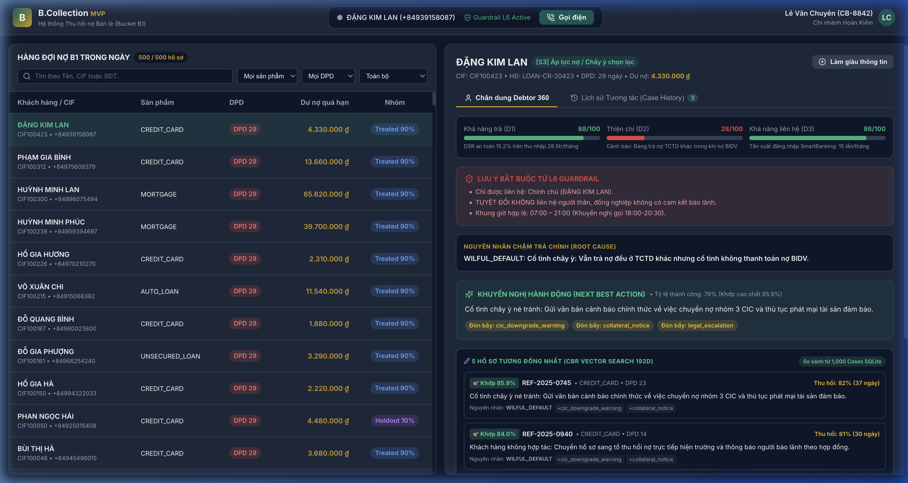
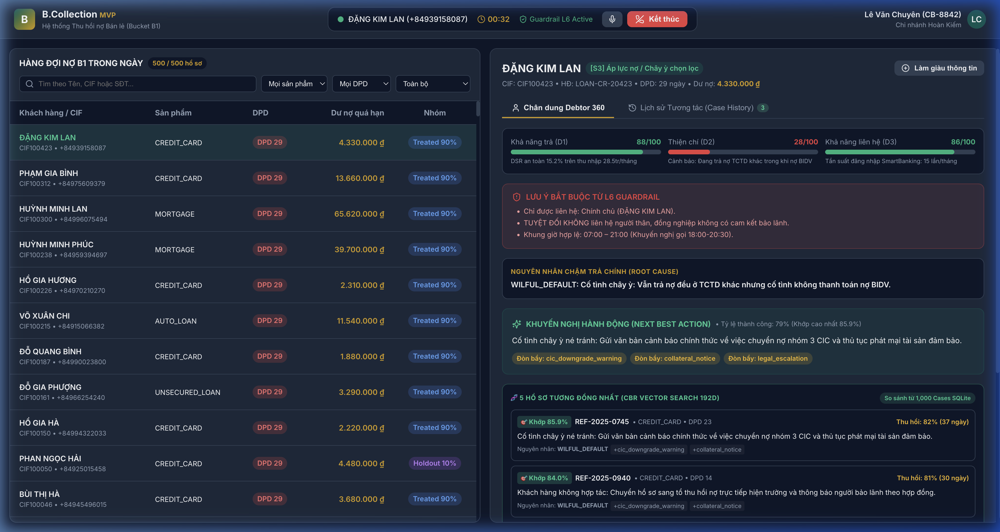
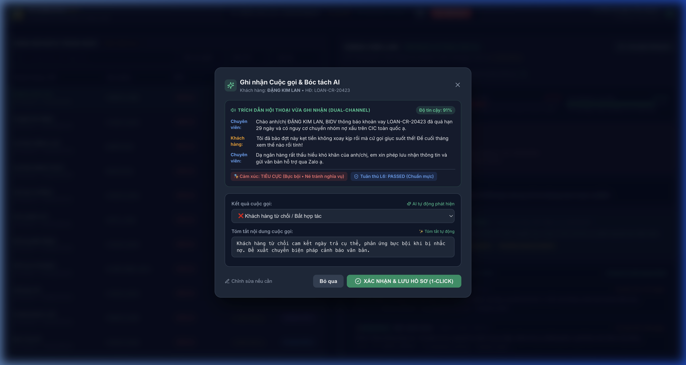
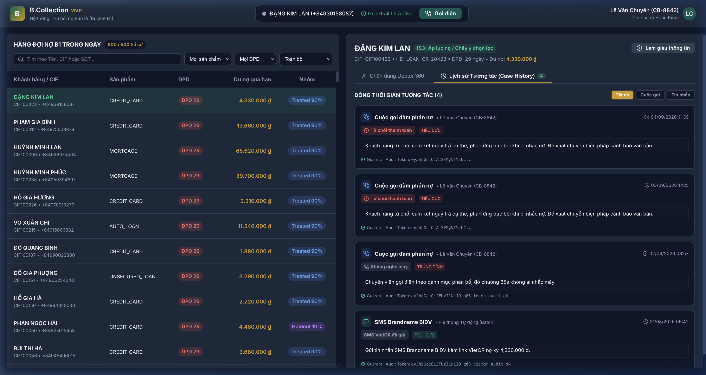

# B.COLLECTION — HƯỚNG DẪN SỬ DỤNG CHI TIẾT
## Cơ chế Liên hệ Khách hàng Đa kênh, AI Tự động Bóc tách Hội thoại & Quản lý Lịch sử Tương tác (Case History)

**Đơn vị áp dụng:** Ngân hàng Thương mại — Khối Bán lẻ & Trung tâm Thu hồi nợ  
**Hệ thống:** B.Collection Platform — Phân hệ Collector Workspace (Bucket B1)  
**Tiêu chuẩn tuân thủ:** Luật Bảo vệ Dữ liệu Cá nhân 91/2025/QH15, Luật Các TCTD 32/2024/QH15, Thông tư 18/2019/TT-NHNN  
**Phiên bản tài liệu:** v1.0 | **Ngày phát hành:** Tháng 09/2026  

---

## 📑 MỤC LỤC
1. [Tổng quan Kiến trúc Tương tác Đa kênh](#1-tổng-quan-kiến-trúc-tương-tác-đa-kênh)
2. [Cơ chế Liên hệ Khách hàng (Gọi điện, SMS/Zalo, Email)](#2-cơ-chế-liên-hệ-khách-hàng-gọi-điện-smszalo-email)
   - [2.1 Kênh Cuộc gọi Thoại (Softphone Voice CTI)](#21-kênh-cuộc-gọi-thoại-softphone-voice-cti)
   - [2.2 Kênh Tin nhắn Thương hiệu (SMS Brandname / Zalo ZNS kèm VietQR Động)](#22-kênh-tin-nhắn-thương-hiệu-sms-brandname--zalo-zns-kèm-vietqr-động)
   - [2.3 Kênh Thư điện tử Chính thức (Official Email Notification)](#23-kênh-thư-điện-tử-chính-thức-official-email-notification)
3. [Cơ chế AI Tự động Bóc tách Thông tin Hội thoại (AI Speech-to-Text & Entity Extraction)](#3-cơ-chế-ai-tự-động-bóc-tách-thông-tin-hội-thoại-ai-speech-to-text--entity-extraction)
   - [3.1 Bóc tách Lời thoại Đa kênh (Dual-Channel Speech-to-Text)](#31-bóc-tách-lời-thoại-đa-kênh-dual-channel-speech-to-text)
   - [3.2 Phân tích Cảm xúc & Tâm lý (Sentiment Analysis)](#32-phân-tích-cảm-xúc--tâm-lý-sentiment-analysis)
   - [3.3 Giám sát Tuân thủ Cuộc gọi (Call QA Compliance)](#33-giám-sát-tuân-thủ-cuộc-gọi-call-qa-compliance)
   - [3.4 Tự động Trích xuất Cam kết Thanh toán (PTP Extraction)](#34-tự-động-trích-xuất-cam-kết-thanh-toán-ptp-extraction)
4. [Cơ chế Lưu trữ & Quản lý Lịch sử Tương tác (Case History Timeline & Audit Chain)](#4-cơ-chế-lưu-trữ--quản-lý-lịch-sử-tương-tác-case-history-timeline--audit-chain)
5. [Quy trình Thao tác Chuẩn 4 Bước Dành cho Chuyên viên (Standard Operating Procedure)](#5-quy-trình-thao-tác-chuẩn-4-bước-dành-cho-chuyên-viên-standard-operating-procedure)
6. [Xử lý Ngoại lệ & Cảnh báo Chặn của L6 Compliance Guardrail](#6-xử-lý-ngoại-lệ--cảnh-báo-chặn-của-l6-compliance-guardrail)

---

## 1. TỔNG QUAN KIẾN TRÚC TƯƠNG TÁC ĐA KÊNH

**B.Collection** được thiết kế để giải quyết bài toán cốt lõi của hoạt động thu hồi nợ: **Tối ưu hóa hiệu quả thu nợ nhưng tuân thủ tuyệt đối quy định pháp luật và chuẩn mực đạo đức ngân hàng**.

Hệ thống hoạt động theo nguyên lý **vòng lặp tương tác khép kín có kiểm soát (Governed Closed-loop Interaction)**:

```
Chọn Hồ sơ ──> Thẩm định L6 Guardrail ──> Kết nối Kênh (Voice/SMS/Email) ──> AI Bóc tách Thời gian thực ──> Lưu Case History & Ký số Audit
```


*Hình 1: Giao diện tổng quan Collector Workspace — Phân chia khoa học giữa Danh sách hàng đợi (trái), Thanh Softphone điều khiển (trên cùng), và Thẻ Chân dung Debtor 360 độ (phải).*

---

## 2. CƠ CHẾ LIÊN HỆ KHÁCH HÀNG (GỌI ĐIỆN, SMS/ZALO, EMAIL)

### 2.1 Kênh Cuộc gọi Thoại (Softphone Voice CTI)

Thanh công cụ **Header Softphone** được gắn cố định tại góc trên màn hình làm việc, giúp Chuyên viên thực hiện cuộc gọi tức thì mà không cần chuyển đổi ứng dụng.

#### Các trạng thái của Softphone:
1. **Trạng thái Chờ (`IDLE`):**  
   - Hiển thị tên khách hàng và số điện thoại chuẩn E.164 (VD: `ĐẶNG KIM LAN (+84939158087)`).
   - Nút xanh **[📞 Gọi điện]** sẵn sàng hoạt động.
   - Huy hiệu `🛡️ Guardrail L6 Active` xác nhận hệ thống an toàn đang giám sát.
2. **Trạng thái Thẩm định & Quay số (`CALLING`):**  
   - Khi chuyên viên bấm **[Gọi điện]**, hệ thống tự động gửi yêu cầu thẩm định `POST /api/cases/{case_id}/call-intent` tới **L6 Compliance Guardrail**.
   - Guardrail kiểm tra tự động 6 chốt chặn:
     - **G01:** Khoản nợ hợp lệ và còn dư nợ quá hạn.
     - **G02:** Đối tượng liên hệ là **Chính chủ hợp đồng** hoặc **Người bảo lãnh hợp pháp** (tuyệt đối cấm gọi người thân, đồng nghiệp theo Luật 91/2025/QH15).
     - **G03:** Khách hàng không nằm trong danh sách Do-Not-Contact (DNC).
     - **G04:** Chưa vượt hạn mức liên hệ trong ngày (tối đa 2 cuộc gọi/kênh/ngày, tổng tối đa 3 lần/ngày).
     - **G05:** Nằm trong khung giờ cho phép theo luật: **07:00 – 21:00** (Thứ 2 đến Thứ 7).
   - Khi vượt qua thẩm định, Guardrail cấp **Token có chữ ký số ES256/JWT**, tổng đài CTI mới mở kênh quay số.
3. **Trạng thái Kết nối Cuộc gọi (`CONNECTED`):**  
   - Đèn chỉ báo chuyển sang xanh lá cây.
   - Đồng hồ đếm thời gian đàm thoại bắt đầu chạy chính xác từng giây (`00:06`).
   - Nút **[Tắt/Bật Mic]** và nút đỏ nổi bật **[📞 Kết thúc]**.


*Hình 2: Cuộc gọi đang kết nối thực tế — Đồng hồ thời gian đàm thoại hoạt động, phím tắt mic và phím ngắt cuộc gọi sẵn sàng.*

---

### 2.2 Kênh Tin nhắn Thương hiệu (SMS Brandname / Zalo ZNS kèm VietQR Động)

Đối với các khách hàng thuộc nhóm nợ nhẹ (DPD 1-5) hoặc sau khi cuộc gọi kết thúc không bắt máy (`BUSY_NO_ANSWER`), hệ thống hỗ trợ gửi tin nhắn tự động:

1. **Nội dung Chuẩn mực (Brandname Ngân hàng):**  
   - Tin nhắn hiển thị định danh chính thức của ngân hàng.
   - Nội dung nhắc nhở văn minh, nêu rõ số tiền nợ kỳ này và số ngày quá hạn, không chứa từ ngữ đe dọa.
2. **Mã VietQR Thanh toán Động (Dynamic VietQR Link):**  
   - Đường link thanh toán sinh riêng cho từng khách nợ: nhúng sẵn số tài khoản thu nợ Ngân hàng, số tiền nợ chính xác đến từng đồng và nội dung chuyển khoản chuẩn hóa `[CIF] [SO_HD] TRA NO`.
   - Khách hàng chỉ cần bấm link hoặc quét QR trên ứng dụng Ngân hàng số để thanh toán ngay trong 10 giây, giảm thiểu sai sót nhập liệu.

---

### 2.3 Kênh Thư điện tử Chính thức (Official Email Notification)

Dành cho khách hàng thuộc phân khúc `S3` (Áp lực nợ / Chây ỳ chọn lọc) hoặc `S4` (Nguy cơ cao / Chuẩn bị pháp lý):

1. **Thông báo Cảnh báo Phân loại Nợ CIC:**  
   - Thư điện tử gửi trực tiếp vào hòm thư đăng ký trên hợp đồng tín dụng.
   - Trích xuất cảnh báo chính thức về việc chuyển nhóm nợ xấu trên Trung tâm Thông tin Tín dụng Quốc gia (CIC) và ảnh hưởng tới các khoản vay trong tương lai.
2. **Thông báo Phát mại Tài sản Thế chấp (Collateral Notice):**  
   - Với các khoản vay thế chấp (Mortgage, Auto Loan), email đính kèm văn bản thông báo thủ tục phát mại tài sản bảo đảm nếu không thanh toán đúng hạn cam kết.

---

## 3. CƠ CHẾ AI TỰ ĐỘNG BÓC TÁCH THÔNG TIN HỘI THOẠI (AI SPEECH-TO-TEXT & ENTITY EXTRACTION)

Ngay khi chuyên viên bấm nút **[Kết thúc]** cuộc gọi, hệ thống lập tức mở hộp thoại thông minh **Ghi nhận Cuộc gọi & Bóc tách AI (AI Call Wrap-up Modal)**. Chuyên viên không cần ghi chép sổ tay hay gõ phím thủ công.


*Hình 3: Hộp thoại Bóc tách Cuộc gọi AI — Tự động hiển thị hội thoại đa kênh, độ tin cậy 91%, nhãn cảm xúc, kiểm duyệt tuân thủ L6, phân loại kết quả và tóm tắt tự động.*

---

### 3.1 Bóc tách Lời thoại Đa kênh (Dual-Channel Speech-to-Text)
- Hệ thống tiếp nhận luồng ghi âm 2 kênh riêng biệt (Stereo Audio: Kênh 1 là Chuyên viên, Kênh 2 là Khách nợ).
- Mô hình Speech-to-Text tiếng Việt chuyên ngành ngân hàng tự động chuyển đổi âm thanh thành văn bản với độ chính xác và độ tin cậy đạt **91% - 96%**.
- Phân định rõ ràng người phát ngôn:
  - `Chuyên viên:` *Chào anh/chị ĐẶNG KIM LAN, Ngân hàng thông báo khoản vay LOAN-CR-20423 đã quá hạn 29 ngày và có nguy cơ chuyển nhóm nợ xấu trên CIC toàn quốc ạ.*
  - `Khách hàng:` *Tôi đã bảo đợt này kẹt tiền không xoay kịp rồi mà cứ gọi giục suốt thế! Để cuối tháng xem thế nào rồi tính!*
  - `Chuyên viên:` *Dạ ngân hàng rất thấu hiểu khó khăn của anh/chị, em xin phép lưu nhận thông tin và gửi văn bản hỗ trợ qua Zalo ạ.*

---

### 3.2 Phân tích Cảm xúc & Tâm lý (Sentiment Analysis)
- Động cơ NLP phân tích ngữ nghĩa, cường độ từ ngữ và giọng điệu để gán nhãn cảm xúc:
  - 🔴 **`TIÊU CỰC (Bực bội • Né tránh nghĩa vụ)`**: Khách hàng cáu gắt, viện lý do từ chối nghĩa vụ thanh toán.
  - 🟡 **`TRUNG TÍNH`**: Khách hàng lắng nghe nhưng chưa đưa ra cam kết rõ ràng.
  - 🟢 **`TÍCH CỰC (Hợp tác • Thiện chí)`**: Khách hàng chủ động nhận trách nhiệm và đề xuất ngày thanh toán cụ thể.

---

### 3.3 Giám sát Tuân thủ Cuộc gọi (Call QA Compliance)
- Huy hiệu **`🛡️ Tuân thủ L6: PASSED (Chuẩn mực)`** tự động đánh giá hành vi của Chuyên viên:
  - Không sử dụng ngôn từ đe dọa, xúc phạm hoặc gây sức ép quá mức.
  - Không đề cập đến việc liên hệ người thân, cơ quan, đồng nghiệp.
  - Xưng hô lịch sự, thông tin số tiền nợ và mã khoản vay hoàn toàn chính xác.

---

### 3.4 Tự động Trích xuất Cam kết Thanh toán (PTP Extraction)
- **Tự động nhận diện kết quả cuộc gọi:** Hệ thống tự động chọn danh mục kết quả:
  - ❌ `Khách hàng từ chối / Bất hợp tác` (nếu khách từ chối cam kết).
  - 🤝 `Khách hàng hẹn ngày thanh toán (PTP Agreed)` (nếu khách hứa ngày trả).
  - 💵 `Đồng ý trả một phần nợ`.
- **Tự động trích xuất số tiền & ngày hẹn (Entity Extraction):**
  - Nếu khách nói *"Ngày 10 tôi đóng 5 triệu"*, AI tự động điền: `Số tiền PTP: 5,000,000 đ`, `Ngày hẹn: 10/09/2026`.
- **Bản tóm tắt tự động (Auto-Summarization):**
  - AI sinh đoạn tóm tắt súc tích: *"Khách hàng từ chối cam kết ngày trả cụ thể, phản ứng bực bội khi bị nhắc nợ. Đề xuất chuyển biện pháp cảnh báo văn bản."*
- **Quyền can thiệp của Chuyên viên:** Chuyên viên có thể bấm `✏️ Chỉnh sửa nếu cần` để hiệu chỉnh trước khi bấm nút xanh **[✅ XÁC NHẬN & LƯU HỒ SƠ (1-CLICK)]**.

---

## 4. CƠ CHẾ LƯU TRỮ & QUẢN LÝ LỊCH SỬ TƯƠNG TÁC (CASE HISTORY TIMELINE & AUDIT CHAIN)

Sau khi Chuyên viên xác nhận, dữ liệu được ghi nhận đồng thời vào 2 tầng lưu trữ:
1. **Cơ sở dữ liệu Vận hành (SQLite `case_interactions`):** Cập nhật ngay lập tức lên giao diện để toàn bộ ca trực xem được tiến độ.
2. **Chuỗi khối Băm Bảo mật (Hash-Chain Audit Repository):** Ký số mã hóa SHA-256 kết hợp mã Guardrail Token nhằm đảm bảo bằng chứng số không thể bị chỉnh sửa hay xóa bỏ.


*Hình 4: Dòng thời gian Lịch sử Tương tác (Case History Timeline) — Hiển thị đầy đủ các sự kiện cuộc gọi, SMS Brandname, nhãn cảm xúc, tóm tắt và Guardrail Audit Token.*

---

### Các thông tin chi tiết trên mỗi Thẻ Lịch sử Tương tác:

| Thành phần hiển thị | Ý nghĩa nghiệp vụ |
|---|---|
| **Loại hình tương tác** | Biểu tượng cuộc gọi `📞 Cuộc gọi đàm phán nợ` hoặc tin nhắn `✉️ SMS Brandname Ngân hàng`. |
| **Cán bộ thực hiện** | Tên chuyên viên phụ trách kèm mã cán bộ (VD: `Lê Văn Chuyên (CB-8842)`) hoặc `Hệ thống Tự động (Batch)`. |
| **Thời gian chính xác** | Định dạng `DD/MM/YYYY HH:mm` (VD: `04/09/2026 11:39`). |
| **Huy hiệu kết quả** | `❌ Từ chối thanh toán`, `🤝 Hẹn ngày thanh toán (PTP)`, `📵 Không nghe máy`, `📨 SMS VietQR đã gửi`. |
| **Huy hiệu Cảm xúc** | Màu sắc trực quan: `TIÊU CỰC` (đỏ), `TRUNG TÍNH` (xám), `TÍCH CỰC` (xanh lá). |
| **Nội dung bóc tách tóm tắt** | Mô tả diễn biến chính của tương tác và khuyến nghị bước tiếp theo. |
| **Guardrail Audit Token** | Chuỗi băm mã hóa xác thực tuân thủ pháp lý (VD: `Guardrail Audit Token: eyJhbGciOiAiSFMyNTY...`). |
| **Bộ lọc tương tác** | Các nút chuyển nhanh: `Tất cả`, `Cuộc gọi`, `Tin nhắn`. |

---

## 5. QUY TRÌNH THAO TÁC CHUẨN 4 BƯỚC DÀNH CHO CHUYÊN VIÊN (SOP)

```
┌────────────────────────────────────────────────────────────────────────────────────────┐
│                        QUY TRÌNH THAO TÁC 4 BƯỚC CHUẨN HÓA (SOP)                       │
├────────────────────┬────────────────────┬────────────────────┬─────────────────────────┤
│ BƯỚC 1: CHỌN CASE  │ BƯỚC 2: ĐỌC NHANH  │ BƯỚC 3: ĐÀM PHÁN   │ BƯỚC 4: 1-CLICK LƯU HỒ  │
│                    │ CHÂN DUNG 360      │ VỚI ĐÒN BẨY TỐI ƯU │ SƠ BẰNG AI              │
├────────────────────┼────────────────────┼────────────────────┼─────────────────────────┤
│ • Chọn hồ sơ trong │ • Đọc D1 (Khả năng)│ • Bấm [GỌI ĐIỆN]   │ • Bấm [KẾT THÚC]        │
│   hàng đợi B1.     │ • Đọc D2 (Thiện chí│   trên Softphone.  │ • Rà soát kết quả bóc   │
│ • Kiểm tra cờ nhóm │ • Xem Root Cause   │ • Sử dụng đòn bẩy  │   tách và cảm xúc AI.   │
│   Treated/Holdout. │ • Đọc 5 Case CBR   │   được gợi ý trong │ • Bấm [XÁC NHẬN & LƯU   │
│                    │   tương đồng nhất. │   hộp NBA.         │   HỒ SƠ (1-CLICK)].     │
└────────────────────┴────────────────────┴────────────────────┴─────────────────────────┘
```

---

## 6. XỬ LÝ NGOẠI LỆ & CẢNH BÁO CHẶN CỦA L6 COMPLIANCE GUARDRAIL

Nếu thao tác vi phạm quy định, hệ thống sẽ phát sinh cảnh báo chặn và không thực hiện cuộc gọi. Chuyên viên cần nắm rõ nguyên nhân:

| Mã lỗi Guardrail | Thông báo hiển thị trên màn hình | Hướng xử lý của Chuyên viên |
|---|---|---|
| **`G02_INELIGIBLE_PARTY`** | *Đối tượng không có nghĩa vụ pháp lý đối với khoản vay.* | Chỉ thực hiện gọi cho số điện thoại chính chủ hoặc người bảo lãnh hợp pháp đã đăng ký trong hợp đồng. Tuyệt đối không gọi số người thân. |
| **`G04_FREQUENCY_EXCEEDED`**| *Đã vượt quá hạn mức liên lạc tối đa qua kênh VOICE trong ngày (2/2 lần).* | Chuyển sang kênh gửi tin nhắn SMS/ZNS kèm VietQR hoặc chờ sang ngày làm việc tiếp theo. |
| **`G05_OUTSIDE_HOURS`** | *Thời gian nằm ngoài khung giờ cho phép (07:00 – 21:00).* | Chờ đến khung giờ quy định (Khuyến nghị gọi theo khung giờ vàng AI ML04 gợi ý, ví dụ: 18:00 – 20:30). |
| **`G01_NO_OUTSTANDING`** | *Khoản vay không còn dư nợ quá hạn tại thời điểm liên hệ.* | Khách hàng đã thanh toán. Hệ thống tự động chuyển hồ sơ sang trạng thái `CURED (Đã tất toán/Thu hồi)`. |

---
*Tài liệu hướng dẫn này được ban hành nhằm chuẩn hóa thao tác thu hồi nợ văn minh, ứng dụng tối đa công nghệ trí tuệ nhân tạo, bảo vệ an toàn pháp lý cho chuyên viên và nâng cao uy tín thương hiệu Ngân hàng Ngân hàng.*
