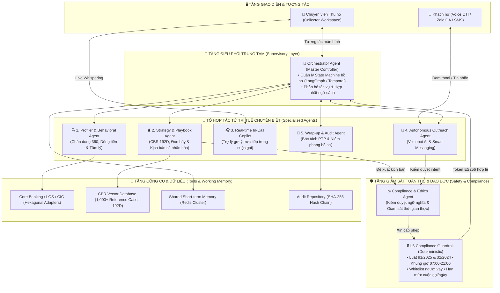
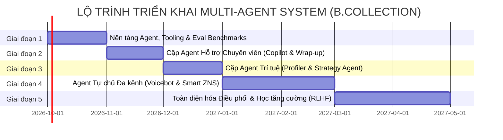

# B.COLLECTION — KIẾN TRÚC MULTI-AGENT SYSTEM (MAS) & LỘ TRÌNH TRIỂN KHAI
### Hệ sinh thái Đa Tác tử AI Tự chủ, Hợp tác & Có kiểm soát trong Thu hồi nợ Bán lẻ (Bucket B1)
**Tác giả & Thẩm định:** Enterprise Architecture & AI/ML Taskforce — Dự án B.Collection  
**Áp dụng:** Ngân hàng TMCP Đầu tư và Phát triển Việt Nam (BIDV) — Khối Bán lẻ, Trung tâm Thu hồi nợ & Khối CNTT  
**Tiêu chuẩn tham chiếu:** BIAN (Banking Industry Architecture Network v12), TOGAF, Luật BVDLCN 91/2025/QH15, Luật Các TCTD 32/2024/QH15, Thông tư 18/2019/TT-NHNN, OWASP Top 10 for LLMs & AI Agents  
**Phiên bản:** v1.0 (Enterprise Specification)  
**Ngày phát hành:** Tháng 09/2026  

---

## 📑 MỤC LỤC
1. [Tuyên ngôn Kiến trúc & Tầm nhìn Chuyển đổi (Vision & Paradigm Shift)](#1-tuyên-ngôn-kiến-trúc--tầm-nhìn-chuyển-đổi-vision--paradigm-shift)
2. [Nguyên tắc Bất biến trong Ngân hàng (Core Governance Principles)](#2-nguyên-tắc-bất-biến-trong-ngân-hàng-core-governance-principles)
3. [Mô hình Kiến trúc Tổng thể Multi-Agent System (MAS Architecture)](#3-mô-hình-kiến-trúc-tổng-thể-multi-agent-system-mas-architecture)
4. [Đặc tả Chi tiết 7 Chuyên biệt AI Agents (Agent Blueprint & Responsibilities)](#4-đặc-tả-chi-tiết-7-chuyên-biệt-ai-agents-agent-blueprint--responsibilities)
5. [Cơ chế Giao tiếp & Bộ nhớ Hợp tác Đa tác tử (Inter-Agent Protocols & Memory)](#5-cơ-chế-giao-tiếp--bộ-nhớ-hợp-tác-đa-tác-tử-inter-agent-protocols--memory)
6. [Lộ trình 5 Bước Xây dựng Hệ thống (5-Phase Implementation Roadmap)](#6-lộ-trình-5-bước-xây-dựng-hệ-thống-5-phase-implementation-roadmap)
7. [Khung Đánh giá, Giám sát (Eval & Observability) & Quản trị Rủi ro](#7-khung-đánh-giá-giám-sát-eval--observability--quản-trị-rủi-ro)
8. [Phụ lục: Đặc tả Agent Tool Call Interface (OpenAPI / JSON-RPC Schema)](#8-phụ-lục-đặc-tả-agent-tool-call-interface-openapi--json-rpc-schema)

---

## 1. TUYÊN NGÔN KIẾN TRÚC & TẦM NHÌN CHUYỂN ĐỔI (VISION & PARADIGM SHIFT)

Trong giai đoạn MVP hiện tại, **B.Collection** đã vận hành thành công kiến trúc Lục giác (Hexagonal Architecture) với các mô hình Machine Learning riêng lẻ (ML01 Self-Cure, ML04 Best-Time-To-Contact), động cơ luật Camunda DMN 1.3 và thuật toán tìm kiếm vector tương đồng CBR 192 chiều. 

Tuy nhiên, giới hạn của mô hình thủ tục (Procedural Programming) là:
- Luồng xử lý tĩnh, không tự điều chỉnh khi phát sinh tình huống bất ngờ trong hội thoại thực tế.
- Chuyên viên con người vẫn phải tự đọc toàn bộ dữ liệu, tự suy nghĩ đối sách và tự chịu áp lực đàm phán trong thời gian thực.
- Hoạt động tự động hóa mới chỉ dừng ở mức gửi tin nhắn hàng loạt theo lịch (Batch SMS/ZNS), chưa có khả năng hội thoại tự nhiên 2 chiều.

**Tầm nhìn Multi-Agent System (MAS):**  
Chuyển đổi B.Collection từ một *"Hệ thống hỗ trợ thông tin thụ động"* thành một **"Tổ hợp tác tử thông minh có mục tiêu (Goal-Driven Autonomous Agent Swarm)"**, trong đó các Agent chuyên trách hợp tác đa tầng để vừa hỗ trợ tối đa chuyên viên con người (Copilot), vừa tự động hóa thu nợ tự chủ ở các phân khúc nợ nhẹ, đồng thời tuân thủ đạo đức và pháp lý nghiêm ngặt 100%.

```
[KIẾN TRÚC HIỆN TẠI: THỦ TỤC & ĐƠN LẺ]
Click Case → Backend API → Truy vấn CSDL → Tính D1/D2/D3 tĩnh → Hiển thị UI → Chuyên viên tự xử lý

                                      ⬇ CHUYỂN ĐỔI (EVOLUTION)

[KIẾN TRÚC TƯƠNG LAI: HỆ SINH THÁI ĐA TÁC TỬ MULTI-AGENT]
Sự kiện nợ → Orchestrator Agent điều phối:
   ├── Profiler Agent: Quét dòng tiền, hành vi & tâm lý thời gian thực
   ├── Strategy Agent: Tổng hợp CBR 192D, thiết kế kịch bản đòn bẩy cá nhân hóa
   ├── Compliance Agent: Kiểm duyệt ngữ nghĩa, xin Token L6 Guardrail
   ├── Outreach Agent: Tự chủ đàm thoại Voicebot / ZNS thông minh (B0/B1 nhẹ)
   ├── In-Call Copilot: Lắng nghe cuộc gọi chuyên viên, gợi ý câu phản biện tức thì
   └── Wrap-up Agent: Bóc tách hội thoại, lập cam kết PTP & niêm phong Audit HashChain
```

---

## 2. NGUYÊN TẮC BẤT BIẾN TRONG NGÂN HÀNG (CORE GOVERNANCE PRINCIPLES)

Hoạt động thu hồi nợ trong ngành ngân hàng chịu sự điều chỉnh gắt gao của Pháp luật và Đạo đức xã hội. Việc áp dụng Multi-Agent System **bắt buộc tuân thủ 4 Nguyên tắc Vàng**:

1. **Guardrail Sovereignty (Chủ quyền Tối thượng của L6 Guardrail):**  
   - Các Agent AI (kể cả Orchestrator) **không có quyền** tự quyết định vi phạm các chốt chặn quy định cứng.
   - Mọi hành động tương tác (gọi điện, gửi tin nhắn, chuyển trạng thái) đều bắt buộc phải lấy được **Guardrail Token ký số ES256/JWT** từ L6 Guardrail Engine (G01 đến G12).
2. **Human-in-the-Loop (Con người nắm quyền quyết định cuối cùng):**  
   - AI Agent chỉ được tự động hóa 100% ở nhóm nợ nhẹ (DPD 1-7, dư nợ < 5 triệu VND, phân khúc S1 Tự khỏi cao).
   - Với các hồ sơ phức tạp, tranh chấp, hoặc đòn bẩy pháp lý nặng (khởi kiện, phát mại tài sản bảo đảm), Agent chỉ đóng vai trò **Copilot tham mưu**, quyền bấm nút thực thi duy nhất thuộc về Chuyên viên/Lãnh đạo ngân hàng.
3. **Separation of Concerns (Phân định Trách nhiệm Độc lập):**  
   - Agent tạo chiến lược (Strategy) **tuyệt đối không kiêm nhiệm** vai trò kiểm duyệt tuân thủ (Compliance). Agent kiểm duyệt phải hoạt động độc lập theo tư duy đối kháng (Red-teaming / Critic Pattern).
4. **Deterministic Auditability (Minh bạch & Giải trình Tuyệt đối):**  
   - Mọi lời nhắc (prompt), ngữ cảnh (context), suy luận nội tâm (Chain-of-Thought) và hành động đầu ra của Agent đều phải được ghi log vào chuỗi khối băm **SHA-256 HashChain**, đảm bảo không thể chỉnh sửa và phục vụ thanh tra Ngân hàng Nhà nước.

---

## 3. MÔ HÌNH KIẾN TRÚC TỔNG THỂ MULTI-AGENT SYSTEM (MAS ARCHITECTURE)



---

## 4. ĐẶC TẢ CHI TIẾT 7 CHUYÊN BIỆT AI AGENTS

### 4.1. 🎯 Orchestrator Agent (Tổng chỉ huy & Điều phối State Machine)
- **Bản chất:** Supervisor / State Graph Controller xây dựng trên nền tảng LangGraph hoặc Temporal Workflow.
- **Nhiệm vụ:**
  - Lắng nghe các Event Bus (Kafka): Sự kiện chuyển trạng thái DPD, khoản thanh toán mới vào Core Banking, chuyên viên chọn hồ sơ trên Workspace.
  - Khởi tạo phiên làm việc của Case, duy trì `CaseContextState` (gồm ID, CIF, nợ quá hạn, lịch sử, điểm D1/D2/D3).
  - Phân bổ tác vụ cho các Agent chuyên biệt theo mô hình DAG (Directed Acyclic Graph) có điều kiện.
  - Xử lý xung đột (Conflict Resolution) khi các Agent đưa ra khuyến nghị trái ngược nhau.

### 4.2. 🔍 Debtor Profiling & Behavioral Agent (Thấu cảm & Chân dung số 360)
- **Bản chất:** Ingestion & Behavioral Feature Agent kết hợp Data Tool Use.
- **Nhiệm vụ:**
  - **Tool Calling:** Tự động kích hoạt `CoreBankingAdapter.get_customer_inflow_profile()`, `CICAdapter.get_credit_report()`, `LOSAdapter.get_loan_collateral()`.
  - **Phân tích Ngữ nghĩa (Semantic Signals):** Trích xuất sắc thái tâm lý từ các ghi chú của chuyên viên trong quá khứ (sự hợp tác, stress, né tránh, nghi ngờ lừa đảo).
  - **Tính toán Điểm số Động:** 
    - Tính $S_{D1}$ (Ability) theo tỷ lệ DSR thu nhập, dòng tiền lương thực nhận và số dư CASA đệm thanh khoản.
    - Tính $S_{D2}$ (Willingness) phạt nặng hành vi trả nợ ngân hàng khác trong khi cố tình để nợ BIDV quá hạn (`paying_other_banks_while_overdue`).
    - Tính $S_{D3}$ (Contactability) dựa trên tỷ lệ RPC và tần suất đăng nhập SmartBanking.
  - **Phân loại Phân khúc:** Gán nhãn tự động vào Ma trận 2x2: `S1` (Tự khỏi cao), `S2` (Lệch dòng tiền), `S3` (Áp lực nợ/Chây ỳ), `S4` (Nguy cơ cao).

### 4.3. ♟️ Strategy & Playbook Synthesis Agent (Chiến lược Đàm phán & Đòn bẩy)
- **Bản chất:** RAG + Case-Based Reasoning (CBR) Synthesis Agent.
- **Nhiệm vụ:**
  - **Vector Similarity:** Chuyển đổi trạng thái hiện tại của hồ sơ thành Vector 192 chiều, truy vấn Top-5 hồ sơ tham chiếu tương đồng nhất trong 1,000 cases lịch sử.
  - **Đề xuất Đòn bẩy tối ưu (Next Best Action):**
    - `cic_downgrade_warning`: Dành cho khách nợ có lịch sử tín dụng tốt hoặc sắp vay vốn.
    - `collateral_notice`: Dành cho khoản vay thế chấp có LTV an toàn.
    - `restructure_offer`: Đề xuất phương án giãn hoãn nợ, thanh toán tối thiểu để giữ nguyên nhóm nợ 1.
  - **Sinh Kịch bản Hội thoại Cá nhân hóa (Personalized Pitch):** Tự sinh kịch bản mở đầu cuộc gọi, câu hỏi khơi gợi và các phương án nhượng bộ bậc thang phù hợp với tính cách của từng khách hàng.

### 4.4. 🎧 Real-time In-Call Copilot Agent (Trợ lý ảo Trong Cuộc gọi)
- **Bản chất:** Streaming Audio / Live Whisper Agent (Độ trễ < 500ms).
- **Nhiệm vụ:**
  - **Lắng nghe luồng Audio 2 chiều (CTI Streaming):** Bóc tách hội thoại real-time bằng mô hình Speech-to-Text tối ưu tiếng Việt chuyên ngành ngân hàng.
  - **Gợi ý phản biện tức thì (Dynamic Whispering):** Nhận diện lập luận của khách hàng và bắn gợi ý ngắn gọn (1-2 câu) lên màn hình của Chuyên viên:
    - *Khách:* "Tôi không có đủ 10 triệu để đóng hôm nay."
    - *Copilot:* $\rightarrow$ *"Gợi ý: Đề xuất đóng trước 2 triệu tiền gốc để giữ nhóm nợ không nhảy lên nhóm 2 CIC, số còn lại cam kết trả vào ngày 15 sau khi nhận lương."*
  - **Fact-Checking tức thời:** Khi khách nói đã thanh toán, Copilot tự kích hoạt `RealTimeBalanceCheckService` để xác nhận ngay trạng thái số dư mà chuyên viên không cần rời màn hình.

### 4.5. 🤖 Autonomous Outreach Agent (Tác tử Thu nợ Tự chủ Đa kênh)
- **Bản chất:** Conversational Voicebot & Interactive Messaging Agent.
- **Nhiệm vụ:**
  - **Voicebot AI tự nhiên:** Đảm nhận gọi điện tự động cho nhóm nợ nhẹ (Bucket B0, đầu B1 - DPD 1-5 ngày). Đàm thoại bằng giọng nói tự nhiên, lịch sự, lắng nghe và trả lời các thắc mắc cơ bản về số tiền nợ, kỳ hạn, số tài khoản nhận tiền.
  - **Smart Interactive Messaging (Zalo ZNS / SMS):** Tạo tin nhắn cá nhân hóa với nội dung ngắn gọn, đính kèm đường link mã VietQR động để khách nợ quét thanh toán tức thì trong 10 giây.
  - **Seamless Human Handover (Chuyển giao Chuyên viên):** Tự động phát hiện khi khách nợ có dấu hiệu kích động, khiếu nại gay gắt hoặc đề xuất phương án vượt thẩm quyền $\rightarrow$ Chuyển tiếp cuộc gọi ngay lập tức cho Chuyên viên con người kèm bản tóm tắt tóm lược bối cảnh.

### 4.6. ⚖️ Compliance & Ethics Guardrail Agent (Giám sát Tuân thủ & Đạo đức)
- **Bản chất:** Critic / Semantic Safety Auditor Agent.
- **Nhiệm vụ:**
  - **Pre-action Inspection:** Quét toàn bộ nội dung tin nhắn, kịch bản đàm phán do *Strategy Agent* hoặc Chuyên viên soạn thảo. Chặn ngay nếu chứa các từ ngữ mang tính đe dọa, xúc phạm, tiết lộ thông tin cho bên thứ ba trái phép.
  - **In-flight Circuit Breaker (Cắt khẩn cấp):** Giám sát liên tục luồng hội thoại của Chuyên viên hoặc Voicebot. Nếu phát hiện vi phạm quy định (nhắc tên người thân không bảo lãnh, gọi ngoài khung giờ 07:00-21:00, đe dọa bạo lực) $\rightarrow$ Ngắt cuộc gọi ngay lập tức và ghi nhận biên bản vi phạm.
  - **Tích hợp Chặt chẽ L6 Guardrail:** Gửi request xin token ủy quyền và kiểm tra các luật cứng (G01 - G12).

### 4.7. 📝 Wrap-up, Resolution & Audit Agent (Hoàn tất Hồ sơ & Niêm phong Kiểm toán)
- **Bản chất:** Structured Information Extraction & Audit Agent.
- **Nhiệm vụ:**
  - **Trích xuất Cam kết PTP:** Đọc transcript cuộc gọi, tự động bóc tách số tiền cam kết (`ptp_amount`), ngày hẹn thanh toán (`ptp_date`), lý do chậm trả và phân loại kết quả cuộc gọi (`PTP_AGREED`, `REFUSED`, `UNREACHABLE`).
  - **Cập nhật CSDL Tức thì:** Cập nhật bảng `cases`, thêm bản ghi vào `case_interactions`, reset hoặc tăng bộ đếm lượt liên hệ `attempt_counters`.
  - **Niêm phong Bằng chứng Số (Evidence Packaging):** Tổng hợp mã token Guardrail, file âm thanh, transcript và kết quả bóc tách, băm thành một block SHA-256 đưa vào `HashChainAuditRepository` để sẵn sàng cho kiểm toán nội bộ và Ngân hàng Nhà nước.

---

## 5. CƠ CHẾ GIAO TIẾP & BỘ NHỚ HỢP TÁC ĐA TÁC TỬ (INTER-AGENT PROTOCOLS & MEMORY)

### 5.1. Định dạng Thông điệp Chuẩn giữa các Agent (Agent Communication Envelope)
Tất cả các Agent giao tiếp qua định dạng JSON-RPC 2.0 có chữ ký số nội bộ:

```json
{
  "trace_id": "TRACE-CASE-2026-10423-REQ-8891",
  "timestamp": "2026-09-03T16:30:00.123Z",
  "sender_agent": "STRATEGY_PLAYBOOK_AGENT",
  "target_agent": "COMPLIANCE_ETHICS_AGENT",
  "intent": "VALIDATE_OUTBOUND_PLAYBOOK",
  "payload": {
    "case_id": "CASE-2026-10423",
    "loan_id": "LOAN-CR-20423",
    "debtor_cif": "CIF100423",
    "proposed_channel": "VOICE",
    "recommended_lever": "cic_downgrade_warning",
    "pitch_script": "Kính chào anh/chị ĐẶNG KIM LAN, khoản vay thẻ tín dụng của anh/chị hiện quá hạn 29 ngày với số tiền 4.330.000đ. Nhằm tránh việc khoản nợ bị tự động phân loại sang Nhóm 3 trên Trung tâm Thông tin Tín dụng Quốc gia (CIC) ảnh hưởng trực tiếp đến các hồ sơ vay vốn trong tương lai, BIDV đề nghị anh/chị thu xếp thanh toán trước 17:00 hôm nay...",
    "concession_options": [
      {"action": "WAIVE_LATE_FEE", "requires_approval": false},
      {"action": "SPLIT_PAYMENT_2_TERMS", "requires_approval": true}
    ]
  },
  "guardrail_context": {
    "target_party_id": "CIF100423",
    "obligation_edge": "BORROWED"
  }
}
```

### 5.2. Kiến trúc Bộ nhớ Phân tầng (Tiered Memory Architecture)
Hệ thống quản lý 3 tầng bộ nhớ để đảm bảo tính nhất quán và hiệu năng:

| Tầng bộ nhớ | Công nghệ sử dụng | Mục đích & Vòng đời |
|---|---|---|
| **Working Memory (Bộ nhớ Phiên)** | Redis Cluster / In-Memory State | Lưu trữ ngữ cảnh cuộc gọi đang diễn ra, trạng thái transcript thời gian thực. Hết hạn sau khi kết thúc phiên (TTL 1 giờ). |
| **Short-term Memory (Hồ sơ Case)** | SQLite / PostgreSQL + Cache | Lưu trữ lịch sử các lần tương tác trong chu kỳ thu hồi hiện tại của khoản nợ (vòng đời 30-90 ngày). |
| **Long-term Knowledge Memory** | Vector DB (192D Embedding) + Lakehouse | Lưu trữ kho tri thức 1,000+ case tham chiếu CBR, các chính sách ngân hàng, tiền lệ xử lý thành công qua các năm. |

---

## 6. LỘ TRÌNH 5 BƯỚC XÂY DỰNG HỆ THỐNG (5-PHASE IMPLEMENTATION ROADMAP)

Để đảm bảo an toàn vận hành trong môi trường ngân hàng thực tế, việc triển khai Multi-Agent System **không làm đại trà một lần** mà phải tuân thủ lộ trình 5 bước lũy tiến:



---

### 🔹 GIAI ĐOẠN 1: Chuẩn hóa Nền tảng Agent & Tool Interface (Tháng 1)
- **Mục tiêu:** Xây dựng hạ tầng cơ sở cho các Agent gọi API an toàn và xác định khung kiểm thử (Evaluation Framework).
- **Các đầu việc cụ thể:**
  1. **Đóng gói Tool Call Schemas:** Chuẩn hóa các Adapter hiện có (`CoreBankingAdapter`, `LOSAdapter`, `CICAdapter`, `RealTimeBalanceCheckService`) thành các Tool Interfaces tương thích OpenAI / Anthropic Function Calling chuẩn OpenAPI 3.0.
  2. **Thiết lập Agent Orchestration Engine:** Cài đặt nền tảng điều phối (LangGraph hoặc Temporal Python SDK), xây dựng State Machine cơ bản của hồ sơ nợ.
  3. **Bộ dữ liệu Kiểm thử Vàng (Golden Evaluation Dataset):** Xây dựng bộ 300 tình huống thu hồi nợ mẫu (gồm ca tiêu chuẩn, ca phức tạp, ca khiêu khích đe dọa, ca vi phạm luật) để chấm điểm chất lượng Agent tự động.

---

### 🔹 GIAI ĐOẠN 2: Cặp Agent Hỗ trợ Chuyên viên — Copilot & Wrap-up (Tháng 2)
- **Mục tiêu:** Tăng năng suất làm việc của chuyên viên con người, giảm 90% thời gian nhập liệu thủ công sau cuộc gọi.
- **Các đầu việc cụ thể:**
  1. **Phát triển `Wrap-up, Resolution & Audit Agent`:** Tích hợp vào Modal kết thúc cuộc gọi hiện tại, tự động nghe ghi âm, tóm tắt hội thoại, bóc tách PTP và cập nhật DB trong 2 giây (Chuyên viên chỉ cần bấm 1 click để phê duyệt).
  2. **Phát triển `Real-time In-Call Copilot Agent`:** Kết nối WebSocket với hệ thống tổng đài CTI, hiển thị Live Whispering và Fact-checking trên giao diện Collector Workspace.
  3. **Chỉ số đo lường (KPI):** Thời gian thực hiện Wrap-up giảm từ **4 phút $\rightarrow$ dưới 30 giây/cuộc gọi**. Tỷ lệ ghi nhận sót thông tin cam kết PTP giảm về **0%**.

---

### 🔹 GIAI ĐOẠN 3: Cặp Agent Trí tuệ — Profiler & Strategy Agent (Tháng 3)
- **Mục tiêu:** Chuyển đổi toàn bộ logic tính toán tĩnh hiện nay sang Agent lập luận sâu, cá nhân hóa kịch bản đàm phán.
- **Các đầu việc cụ thể:**
  1. **Nâng cấp `Debtor Profiling & Behavioral Agent`:** Kết hợp các mô hình ML01/ML04 hiện có với khả năng đọc hiểu ngữ cảnh NLP từ các lần tương tác trước để chẩn đoán nguyên nhân gốc nợ xấu.
  2. **Phát triển `Strategy & Playbook Synthesis Agent`:** Kết hợp Vector Search 192 chiều trên 1,000 cases SQLite để sinh kịch bản đàm phán phù hợp cho từng cá nhân.
  3. **Tích hợp `Compliance & Ethics Agent`:** Đóng vai trò Critic kiểm duyệt kịch bản đàm phán trước khi hiển thị cho chuyên viên.

---

### 🔹 GIAI ĐOẠN 4: Tác tử Thu nợ Tự chủ Đa kênh — Autonomous Outreach (Tháng 4 - 5)
- **Mục tiêu:** Tự động hóa hoàn toàn 60% khối lượng công việc ở phân khúc nợ nhẹ.
- **Các đầu việc cụ thể:**
  1. **Tích hợp AI Voicebot:** Kết nối Gateway SIP/FreeSWITCH của ngân hàng, chạy thử nghiệm gọi điện tự động cho danh mục nợ B0/B1 nhẹ (DPD 1 - 5 ngày, số tiền < 5 triệu VND).
  2. **Smart Messaging Agent:** Tự động gửi tin nhắn tương tác qua Zalo Official Account (ZNS) kèm mã QR VietQR động thanh toán ngay.
  3. **Cơ chế Chuyển tiếp Chuyên viên (Seamless Human Handover):** Khi khách hàng có biểu hiện bức xúc hoặc khiếu nại, Voicebot chuyển máy ngay lập tức cho Chuyên viên trực kèm tóm tắt ngữ cảnh.
  4. **Chỉ số đo lường (KPI):** Tỷ lệ tự khỏi và thu hồi thành công qua kênh tự động đạt $\ge 35\%$, giải phóng 60% thời gian gọi điện cho chuyên viên.

---

### 🔹 GIAI ĐOẠN 5: Toàn diện hóa Điều phối & Học tăng cường Khép kín (Tháng 6+)
- **Mục tiêu:** Hệ thống Multi-Agent vận hành tự chủ toàn diện và tự hoàn thiện qua dữ liệu thực tế.
- **Các đầu việc cụ thể:**
  1. **Orchestrator Agent toàn diện:** Quản trị vòng đời khép kín của toàn bộ 500 hồ sơ nợ trên hệ thống, tự động phân luồng hồ sơ nào nên để Voicebot gọi, hồ sơ nào chuyển Chuyên viên cao cấp.
  2. **Khép kín Vòng lặp Học hỏi (Closed-loop Self-Learning):** Khi một cam kết PTP được thanh toán thành công (hoặc bị phá vỡ), hệ thống tự động đưa hội thoại đó vào bộ nhớ dài hạn (Vector RAG) để cập nhật chiến lược đàm phán cho các Agent trong tương lai.
  3. **Hệ thống Kiểm toán HashChain Toàn trình:** Xuất báo cáo tuân thủ tự động theo biểu mẫu của Thanh tra Ngân hàng Nhà nước chỉ với 1 click.

---

## 7. KHUNG ĐÁNH GIÁ, GIÁM SÁT (EVAL & OBSERVABILITY) & QUẢN TRỊ RỦI RO

### 7.1. Khung Giám sát Hiệu năng Tác tử (Agent Observability & Tracing)
- **Công nghệ đề xuất:** OpenTelemetry + Langfuse / Phoenix Tracing.
- **Chỉ số giám sát trọng yếu:**
  - **Tool Execution Success Rate:** Tỷ lệ gọi các Integration Adapters thành công ($\ge 99.8\%$).
  - **Hallucination Rate (Tỷ lệ bịa đặt thông tin):** Đo lường bằng bộ câu hỏi đối chiếu dữ liệu gốc ($\le 0.01\%$). Tuyệt đối không được bịa đặt sai số tiền nợ hay thông tin tài khoản.
  - **Compliance Rejection Rate:** Tỷ lệ kịch bản do Strategy Agent sinh ra bị Compliance Agent chặn lại ($\le 2\%$).
  - **End-to-End Latency:** Độ trễ sinh phản hồi của Real-time Copilot ($\le 600\text{ms}$).

### 7.2. Ma trận Quản trị Rủi ro Agent trong Ngân hàng

| Nguy cơ rủi ro | Mức độ | Biện pháp Phòng vệ Kiến trúc (Mitigation Architecture) |
|---|:---:|---|
| **Agent bị Jailbreak / Prompt Injection** (Khách hàng gài bẫy để xóa nợ) | **CỰC CAO** | Tách biệt hoàn toàn System Prompt với User Input; L6 Guardrail chốt chặn cứng mọi thao tác xóa nợ (xóa nợ đòi hỏi phê duyệt 2 cấp con người). |
| **Agent nói sai thông tin tài chính / lãi suất** | **CAO** | Sử dụng RAG chặt chẽ, buộc Agent trích dẫn chính xác tham số từ API Core Banking; cấm LLM tự tính nhẩm lãi suất. |
| **Vi phạm khung giờ hoặc quấy rối khách hàng** | **CỰC CAO** | Chốt chặn G04 (Frequency Cap) và G05 (Time Window) của L6 Guardrail can thiệp ở mức Gateway, tự động cắt kết nối vật lý nếu ngoài giờ 07:00-21:00. |
| **Lộ lọt thông tin cá nhân khách nợ cho bên thứ ba** | **CỰC CAO** | G02 Party Eligibility Control xác thực quyền liên hệ; Compliance Agent tự động che (masking) số CMND/CCCD và dữ liệu nhạy cảm theo Luật 91/2025/QH15. |

---

## 8. PHỤ LỤC: ĐẶC TẢ AGENT TOOL CALL INTERFACE (OPENAPI / JSON-RPC SCHEMA)

Dưới đây là đặc tả chuẩn JSON Schema để các LLM Agent gọi trực tiếp vào hệ thống Adapters hiện có của B.Collection:

```json
{
  "$schema": "https://json-schema.org/draft/2020-12/schema",
  "title": "BCollectionAgentToolInterfaces",
  "type": "object",
  "tools": [
    {
      "name": "check_realtime_balance",
      "description": "Kiểm tra số dư nợ thời gian thực trên Core Banking (IF-CORE-04) để xác minh xem khách nợ đã thanh toán trong vòng 15 phút qua hay chưa.",
      "parameters": {
        "type": "object",
        "properties": {
          "loan_id": {"type": "string", "description": "Mã hợp đồng khoản vay (VD: LOAN-CR-20423)"},
          "debtor_cif": {"type": "string", "description": "Mã định danh khách hàng CIF (VD: CIF100423)"}
        },
        "required": ["loan_id", "debtor_cif"]
      }
    },
    {
      "name": "find_cbr_similar_playbooks",
      "description": "Tìm kiếm Top-K trường hợp tương đồng trong quá khứ dựa trên không gian vector 192 chiều và nguyên nhân gốc rễ để lấy kịch bản đàm phán tối ưu.",
      "parameters": {
        "type": "object",
        "properties": {
          "case_id": {"type": "string", "description": "Mã hồ sơ nợ"},
          "root_cause": {"type": "string", "enum": ["WILFUL_DEFAULT", "CASHFLOW_MISMATCH", "BUSINESS_SHOCK", "FORGETFULNESS"]},
          "top_k": {"type": "integer", "default": 5}
        },
        "required": ["case_id", "root_cause"]
      }
    },
    {
      "name": "request_guardrail_authorization",
      "description": "Gửi yêu cầu thẩm định pháp lý và cấp Guardrail Token có chữ ký số ES256/JWT trước khi thực hiện bất kỳ hành động gọi điện hoặc gửi tin nhắn nào.",
      "parameters": {
        "type": "object",
        "properties": {
          "loan_id": {"type": "string"},
          "target_party_id": {"type": "string"},
          "channel": {"type": "string", "enum": ["VOICE", "SMS", "ZALO"]},
          "action_type": {"type": "string", "enum": ["VOICE_CALL_OUTBOUND", "SEND_INTERACTIVE_ZNS", "SEND_SMS_VIETQR"]}
        },
        "required": ["loan_id", "target_party_id", "channel", "action_type"]
      }
    }
  ]
}
```

---
*Tài liệu này là đặc tả kiến trúc chính thức của Dự án B.Collection, đóng vai trò kim chỉ nam kỹ thuật cho Khối CNTT và Khối Bán lẻ BIDV trong giai đoạn nâng cấp chuyển đổi số toàn diện hoạt động Thu hồi nợ.*
