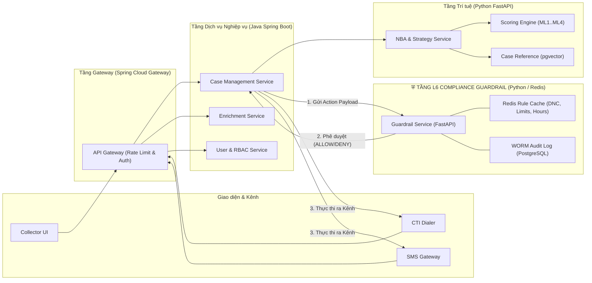

# B.COLLECTION — ĐỀ XUẤT TECH STACK & KIẾN TRÚC KỸ THUẬT CHO GIAI ĐOẠN MVP
### Lựa chọn Công nghệ Thực chiến: Tối ưu Tốc độ Ra mắt (Go-to-Market) nhưng Sẵn sàng Mở rộng (Enterprise Scale)
**Vai trò:** Lead Enterprise Architect | **Dự án:** Hệ thống B.Collection — Ngân hàng  
**Giai đoạn:** MVP (Tháng 1 – 4) $\rightarrow$ Target Production (Tháng 6 – 18)  
**Phiên bản:** v1.0

---

## 📑 MỤC LỤC
1. [Triết lý Lựa chọn Tech Stack cho MVP Ngân hàng](#1-triết-lý-lựa-chọn-tech-stack-cho-mvp-ngân-hàng)
2. [Bảng Tổng hợp Tech Stack: MVP Stack vs Target Enterprise Stack](#2-bảng-tổng-hợp-tech-stack-mvp-stack-vs-target-enterprise-stack)
3. [Chi tiết Kiến trúc Kỹ thuật theo từng Khối (Component Deep-Dive)](#3-chi-tiết-kiến-trúc-kỹ-thuật-theo-từng-khối-component-deep-dive)
   * [3.1 Frontend & User Experience (Collector Workspace & Self-Service)](#31-frontend--user-experience-collector-workspace--self-service)
   * [3.2 Backend Services & Tầng Bảo vệ L6 Guardrail](#32-backend-services--tầng-bảo-vệ-l6-guardrail)
   * [3.3 Workflow Engine & Orchestration (Temporal vs Camunda)](#33-workflow-engine--orchestration-temporal-vs-camunda)
   * [3.4 Data & Storage: PostgreSQL + pgvector vs Dedicated Lakehouse](#34-data--storage-postgresql--pgvector-vs-dedicated-lakehouse)
   * [3.5 Graph Database cho MVP](#35-graph-database-cho-mvp)
   * [3.6 AI / ML / MLOps Pipeline](#36-ai--ml--mlops-pipeline)
   * [3.7 Tích hợp Tổng đài (CTI / Softphone) & Kênh số (Zalo/SMS)](#37-tích-hợp-tổng-đài-cti--softphone--kênh-số-zalosms)
   * [3.8 Security, Identity & Observability](#38-security-identity--observability)
4. [Kiến trúc Triển khai Hạ tầng MVP (Infrastructure Topology)](#4-kiến-trúc-triển-khai-hạ-tầng-mvp-infrastructure-topology)
5. [Dự toán Tài nguyên Phần cứng & Nhân sự MVP (Resource & Sizing)](#5-dự-toán-tài-nguyên-phần-cứng--nhân-sự-mvp-resource--sizing)
6. [Kế hoạch Thực thi MVP 120 Ngày (120-Day Execution Plan)](#6-kế-hoạch-thực-thi-mvp-120-ngày-120-day-execution-plan)

---

## 1. TRIẾT LÝ LỰA CHỌN TECH STACK CHO MVP NGÂN HÀNG

Khi làm MVP cho một ngân hàng lớn, cạm bẫy lớn nhất là **"Over-engineering"** (dựng ngay từ đầu một cụm Hadoop/Spark 20 nodes, Kubernetes đa cụm, 5 loại database khác nhau khiến 6 tháng đầu chỉ lo cài cắm hạ tầng).

Nguyên tắc chọn Tech Stack cho B.Collection MVP:
1. **"Boring Technology" ở Lõi (Core Reliability):** Sử dụng các công nghệ cực kỳ ổn định, quen thuộc với đội ngũ kỹ sư ngân hàng (PostgreSQL, Java Spring Boot / Python FastAPI, Redis).
2. **Kế thừa Tài sản Sẵn có (Zero Waste):** Tận dụng lại hạ tầng LLM Gateway, Kafka và Temporal đã triển khai từ dự án *CreditAgent* và *Hệ thống KHLQ*.
3. **Mở rộng Không Đập Đi Xây Lại (Evolutionary Architecture):** Sử dụng PostgreSQL + `pgvector` và Apache Iceberg cho MVP; khi dữ liệu đạt hàng chục triệu case có thể tách sang Milvus và cụm Lakehouse chuyên biệt mà không phải sửa logic nghiệp vụ.

---

## 2. BẢNG TỔNG HỢP TECH STACK: MVP VS TARGET STACK

```
┌────────────────────────────────────────────────────────────────────────────────────────┐
│                   MA TRẬN CÔNG NGHỆ B.COLLECTION (TECH MATRIX)                         │
├──────────────────────┬──────────────────────────────┬──────────────────────────────────┤
│ Lớp Thành Phần       │ LỰA CHỌN MVP (0 – 4 THÁNG)    │ ĐÍCH MỞ RỘNG (TARGET 18 THÁNG)   │
├──────────────────────┼──────────────────────────────┼──────────────────────────────────┤
│ Frontend (Workspace) │ React 18 + TypeScript + Vite │ React Micro-frontends (Module    │
│                      │ + Ant Design / Tailwind CSS  │ Federation) + Mobile React Native│
├──────────────────────┼──────────────────────────────┼──────────────────────────────────┤
│ Self-Service Portal  │ Next.js (SSR/Static) + PWA   │ Next.js + Mini App (Zalo/Ngân hàng)   │
├──────────────────────┼──────────────────────────────┼──────────────────────────────────┤
│ Backend Core API     │ Java Spring Boot 3.x (Java21)│ Java Spring Boot 3 (Microservice)│
├──────────────────────┼──────────────────────────────┼──────────────────────────────────┤
│ AI & Decision Engine │ Python FastAPI + Pydantic v2 │ Python FastAPI + gRPC Streaming  │
├──────────────────────┼──────────────────────────────┼──────────────────────────────────┤
│ L6 Guardrail Engine  │ Python FastAPI + Redis Cache │ Rust / Go Micro-daemon (Sub-10ms)│
├──────────────────────┼──────────────────────────────┼──────────────────────────────────┤
│ Workflow (BPM)       │ Temporal.io (Durable Code)   │ Temporal Cluster (Multi-zone)    │
├──────────────────────┼──────────────────────────────┼──────────────────────────────────┤
│ Primary Database     │ PostgreSQL 16 (HA Patroni)   │ PostgreSQL 16 + Citus Sharding   │
├──────────────────────┼──────────────────────────────┼──────────────────────────────────┤
│ Vector Database      │ pgvector (Extension Postgres)│ Milvus / Qdrant Cluster          │
├──────────────────────┼──────────────────────────────┼──────────────────────────────────┤
│ Graph Database       │ Neo4j Community / Enterprise │ Neo4j Causal Cluster + Spark GDS │
├──────────────────────┼──────────────────────────────┼──────────────────────────────────┤
│ Caching & Online FS  │ Redis Standalone (Cluster HA)│ Redis Enterprise Cluster         │
├──────────────────────┼──────────────────────────────┼──────────────────────────────────┤
│ Message Broker       │ Apache Kafka (Shared Cluster)│ Dedicated Event Streaming Mesh   │
├──────────────────────┼──────────────────────────────┼──────────────────────────────────┤
│ AI / ML Models       │ LightGBM + Scikit-Learn +    │ LightGBM + PyTorch + CausalML    │
│                      │ Vietnamese Sentence-BERT     │ (Uplift) + GPU Cluster On-prem   │
├──────────────────────┼──────────────────────────────┼──────────────────────────────────┤
│ CTI / Softphone      │ SIP.js (WebRTC Softphone)    │ Tích hợp CTI Avaya / Cisco PBX   │
├──────────────────────┼──────────────────────────────┼──────────────────────────────────┤
│ Container & DevOps   │ Docker Compose / Single K8s  │ RedHat OpenShift on Bare-metal   │
└──────────────────────┴──────────────────────────────┴──────────────────────────────────┘
```

---

## 3. CHI TIẾT KIẾN TRÚC KỸ THUẬT THEO TỪNG KHỐI

### 3.1 Frontend & User Experience (Collector Workspace & Portal)

* **Collector Workspace (Giao diện Chuyên viên):**
  * **Công nghệ:** `React 18` + `TypeScript` + `Vite` + `Ant Design (AntD)`.
  * **Lý do chọn:** AntD là UI Kit chuẩn doanh nghiệp, có sẵn bảng dữ liệu phức tạp, form nhập liệu có kiểm định, timeline lịch sử, hỗ trợ theme tối/sáng và thời gian dựng UI nhanh gấp 3 lần so với viết CSS thuần.
  * **Tối ưu UX:** Tích hợp `SIP.js` tạo thanh Softphone ngay trên Header; React Query (`TanStack Query`) để cache dữ liệu Persona Card tải dưới 500ms.
* **Self-Service Portal (Cổng Khách hàng Tự trả nợ):**
  * **Công nghệ:** `Next.js 14 (App Router)` + `Tailwind CSS`.
  * **Lý do chọn:** Tối ưu hóa tải trang trên thiết bị di động (Mobile-First), sinh mã VietQR động, bảo mật bằng Tokenized URL dùng một lần.

---

### 3.2 Backend Services & Tầng Bảo vệ L6 Guardrail



* **Core Business Backend:** `Java 21` + `Spring Boot 3.2`.
  * Đảm nhiệm: Quản lý vòng đời Case, phân quyền dữ liệu ABAC/RBAC, hạch toán với Core Banking, quản lý hồ sơ tài sản.
  * Tận dụng Virtual Threads (Project Loom trong Java 21) cho hiệu năng I/O cực cao.
* **Tầng L6 Compliance Guardrail:** `Python FastAPI` + `Redis`.
  * Đảm nhiệm: Chạy 8 cổng kiểm tra tuân thủ với thời gian phản hồi **$< 15\text{ms}$**. Toàn bộ danh sách đen (DNC), giới hạn số lần gọi trong ngày của khách hàng được lưu trên RAM Redis Key-Value (`INCRBY` + `EXPIRE 24h`).

---

### 3.3 Workflow Engine & Orchestration: Temporal.io

* **Lựa chọn:** `Temporal.io` (Go/Java/Python SDK).
* **Tại sao chọn Temporal thay vì Camunda cho MVP?**
  1. **Durable Execution as Code:** Viết quy trình xử lý nợ bằng code (Java/Python) thay vì phải vẽ sơ đồ BPMN XML phức tạp. Dễ test tự động (Unit Test quy trình như test code).
  2. **Quản lý Timeouts & Retry xuất sắc:** Một case thu nợ kéo dài 60–90 ngày với hàng chục bước chờ (Chờ khách trả tiền trong 48h $\rightarrow$ Nhắc lần 2 $\rightarrow$ Chờ 7 ngày $\rightarrow$ Phân công gọi điện). Temporal tự động đóng băng state và đánh thức quy trình mà không tốn tài nguyên DB.
  3. **Kế thừa:** Đội ngũ ngân hàng đã có kinh nghiệm vận hành Temporal từ dự án *CreditAgent*.

---

### 3.4 Data & Storage: PostgreSQL 16 + pgvector (All-in-One Data Engine cho MVP)

Thay vì dựng cụm Elasticsearch, Milvus và MongoDB riêng biệt cho MVP, giải pháp thông minh nhất là sử dụng **PostgreSQL 16 Enterprise** làm cơ sở dữ liệu hợp nhất:
1. **Dữ liệu Quan hệ (Relational Data):** Lưu trữ Hợp đồng, Giao dịch, Khách hàng, Bảng phân quyền.
2. **Event Sourcing & JSON Payload:** Dùng kiểu dữ liệu `JSONB` với GIN Index cho `EnrichmentFact` và `DebtorPersona`.
3. **Vector Database cho CBR (Case Reference):** Sử dụng extension `pgvector` với chỉ mục **HNSW (Hierarchical Navigable Small World)** để lưu trữ và tìm kiếm tương đồng vector 192 chiều. Tốc độ tìm kiếm Top-5 case tương đồng đạt **$< 20\text{ms}$** trên tập 500.000 records.
4. **Audit Trail (Log Bất biến):** Sử dụng bảng phân vùng theo tháng (Partitioned Table) với cơ chế Append-Only + Triggers chống sửa xóa.

---

### 3.5 Graph Database cho MVP

* **Lựa chọn:** `Neo4j 5.x Community Edition` hoặc `Enterprise VM`.
* **Cơ chế hoạt động MVP:**
  * Dữ liệu Master khách hàng và khoản vay từ PostgreSQL được đồng bộ sang Neo4j qua CDC hoặc script Python nightly.
  * Neo4j đảm nhận:
    1. Tra cứu 1-hop / 2-hop mạng lưới người bảo lãnh, đồng vay, tài sản (`COLLATERAL`, `GUARANTOR`).
    2. Cung cấp API cho màn hình `Graph Visualizer` trên Collector Workspace.
  * Các thuật toán nặng (Louvain / PageRank) được chạy offline bằng thư viện `NetworkX` hoặc `iGraph` trên Python và ghi kết quả ngược lại PostgreSQL.

---

### 3.6 AI / ML / MLOps Pipeline

```
┌────────────────────────────────────────────────────────────────────────────────────────┐
│                              AI / ML STACK CHO GIAI ĐOẠN MVP                           │
├──────────────────────┬─────────────────────────────────────────────────────────────────┤
│ Tabular ML (ML1-ML4) │ LightGBM / XGBoost + Optuna (Hyperparameter Tuning)             │
├──────────────────────┼─────────────────────────────────────────────────────────────────┤
│ NLP & Text Embedding │ PhoBERT / BKAI-Vietnamese-bi-encoder (cho Embedding tiếng Việt) │
├──────────────────────┼─────────────────────────────────────────────────────────────────┤
│ Speech Analytics ASR │ OpenAI Whisper Large-v3 fine-tuned tiếng Việt (Chạy offline GPU)│
├──────────────────────┼─────────────────────────────────────────────────────────────────┤
│ Model Tracking       │ MLflow (Track metrics, parameters & model artifacts)           │
├──────────────────────┼─────────────────────────────────────────────────────────────────┤
│ Model Serving        │ FastAPI + ONNX Runtime (Tối ưu CPU inference < 25ms)            │
└──────────────────────┴─────────────────────────────────────────────────────────────────┘
```

---

### 3.7 Tích hợp Tổng đài (CTI / Softphone) & Kênh số

* **Voice / Softphone (WebRTC):**
  * Tích hợp thư viện `SIP.js` trực tiếp vào React frontend.
  * Chuyên viên chỉ cần cắm tai nghe qua trình duyệt là có thể nghe gọi (Click-to-Call), không cần cài phần mềm ngoài.
  * Kết nối tới Tổng đài nội bộ qua giao thức SIP / WebRTC Gateway (FreeSWITCH hoặc Asterisk PBX).
* **Kênh OTT / Zalo / SMS:**
  * Tích hợp trực tiếp API **Zalo Cloud (ZNS)** và **SMS Brandname Gateway** sẵn có của ngân hàng.

---

### 3.8 Security, Identity & Observability

* **Identity & Authentication:** `Keycloak` (OpenID Connect / OAuth2) tích hợp Active Directory (LDAP/AD) của ngân hàng.
* **Secret Management:** `HashiCorp Vault` lưu trữ API keys, certificates và DB credentials.
* **Observability & Logging:**
  * Metrics: `Prometheus` + `Grafana Dashboard`.
  * Tracing: `OpenTelemetry` + `Jaeger`.
  * Centralized Logs: `Loki` hoặc `Elasticsearch (ELK)`.

---

## 4. KIẾN TRÚC TRIỂN KHAI HẠ TẦNG MVP (INFRASTRUCTURE TOPOLOGY)

Toàn bộ hệ thống MVP có thể triển khai gọn gàng trên **3 máy chủ ảo (VMs) On-Premise** (hoặc 1 Cụm Kubernetes nội bộ):

```
┌────────────────────────────────────────────────────────────────────────────────────────┐
│                           KIẾN TRÚC MÁY CHỦ TRIỂN KHAI MVP                             │
├────────────────────────────────────────────────────────────────────────────────────────┤
│ 🖥️ VM 1: APPLICATION & GATEWAY SERVER (16 vCPU, 32GB RAM, 200GB SSD)                    │
│    ├── NGINX Reverse Proxy & SSL Termination                                           │
│    ├── Spring Boot Core API Services (2 instances)                                     │
│    ├── Python FastAPI AI & Guardrail Engine (2 instances)                              │
│    ├── Temporal Worker & Frontend Static Web Hosting                                   │
│    └── Keycloak IAM Gateway                                                            │
├────────────────────────────────────────────────────────────────────────────────────────┤
│ 🗄️ VM 2: DATA & STORAGE SERVER (16 vCPU, 64GB RAM, 1TB NVMe SSD)                        │
│    ├── PostgreSQL 16 Enterprise + pgvector Extension (Master DB)                       │
│    ├── Redis Standalone (Session, Guardrail Limits & Fast Cache)                       │
│    ├── Neo4j Database (Graph Storage & 1-Hop Traversal)                                │
│    └── Temporal Server & History DB                                                    │
├────────────────────────────────────────────────────────────────────────────────────────┤
│ 🧠 VM 3: AI WORKER & SPEECH ANALYTICS SERVER (8 vCPU, 32GB RAM, 1x NVIDIA RTX A4000)   │
│    ├── Nightly ML Scoring & Batch Feature Pipeline                                     │
│    ├── Post-Call Whisper ASR Speech-to-Text Worker                                     │
│    ├── MLflow Tracking Server                                                          │
│    └── Prometheus & Grafana Monitoring Stack                                           │
└────────────────────────────────────────────────────────────────────────────────────────┘
```

---

## 5. DỰ TOÁN TÀI NGUYÊN PHẦN CỨNG & NHÂN SỰ MVP

### 5.1 Đội ngũ Kỹ thuật Cần thiết (Core Team MVP: 8 – 10 Người)
* **1 Lead Solution Architect / Tech Lead:** Điều phối kiến trúc tổng thể.
* **2 Backend Engineers (Java Spring Boot):** Xây dựng Core API, Maker-Checker, hạch toán Core.
* **1 AI / Data Scientist (Python):** Xây dựng mô hình ML1 (Self-cure), ML4 (Best-time), CBR vector.
* **2 Frontend Engineers (React/Next.js):** Xây dựng Collector Workspace, CTI Softphone và Portal.
* **1 Data Engineer:** Xây dựng Ingestion Pipeline từ Core Banking/Cards sang PostgreSQL/Neo4j.
* **1 DevOps / Security Engineer:** Dựng hạ tầng VM/K8s, CI/CD, Keycloak, SSL, Vault.
* **1 Lead Business Analyst (BA):** Kiểm soát logic nghiệp vụ và nghiệm thu luồng.

---

## 6. KẾ HOẠCH THỰC THI MVP 120 NGÀY (120-DAY EXECUTION PLAN)

```
Tháng 1: THIẾT LẬP NỀN TẢNG (Sprint 1 - 2)
├── Dựng hạ tầng VM, PostgreSQL 16 + pgvector, Redis, Keycloak, Temporal.
├── Thiết lập Data Pipeline nạp 500.000 hồ sơ quá hạn lịch sử để làm sạch SĐT.
└── Xây dựng khung L6 Guardrail Service & Database Schemas.

Tháng 2: CORE WORKFLOW & WORKSPACE (Sprint 3 - 4)
├── Phát triển Collector Workspace UI + Tích hợp WebRTC Softphone (Click-to-Call).
├── Xây dựng Workflow phân công hồ sơ trên Temporal BPM.
└── Tích hợp Zalo ZNS / SMS Gateway cho Luồng 1 (Early Collection).

Tháng 3: AI SCORING & SELF-SERVICE PORTAL (Sprint 5 - 6)
├── Triển khai 3 mô hình đầu: ML1 (Self-cure), ML4 (Best-time), Vector Search (CBR).
├── Hoàn thiện Cổng Thanh toán Tự phục vụ (Self-Service Portal) có mã VietQR.
└── Thiết lập nhóm đối chứng (Holdout Group 10%) để đo lường hiệu quả.

Tháng 4: THỬ NGHIỆM THỰC ĐỊA & ĐO LƯỜNG (Sprint 7 - 8)
├── Chạy thử nghiệm thí điểm (Pilot) trên 1 Chi nhánh hoặc 1 Trung tâm Thu hồi nợ.
├── Tinh chỉnh trọng số AI, vá lỗi giao diện dựa trên phản hồi của 20 Collector đầu tiên.
└── Nghiệm thu kết quả MVP: Đo lường Cure Rate, Cost-to-Collect và tỷ lệ RPC.
```

---
*Bản đề xuất Tech Stack được biên soạn bởi Enterprise Architect, sẵn sàng cho buổi thẩm định kỹ thuật (Technical Review Meeting) với Khối Công nghệ Thông tin.*
